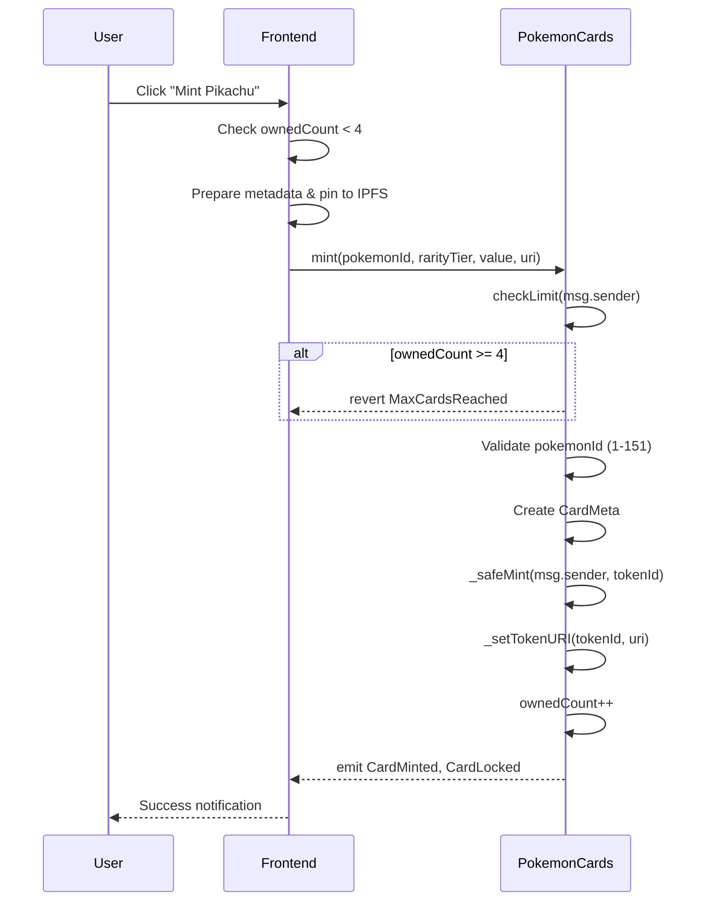
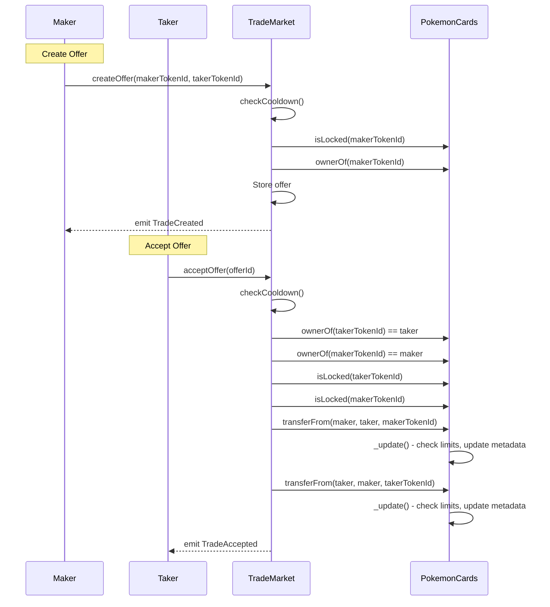
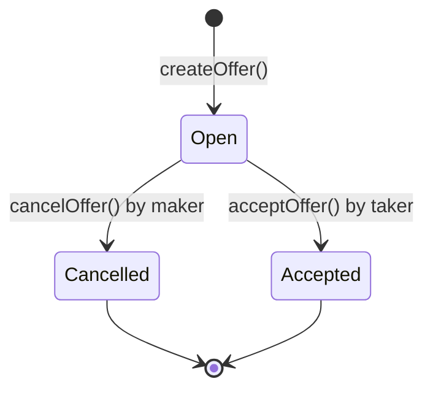
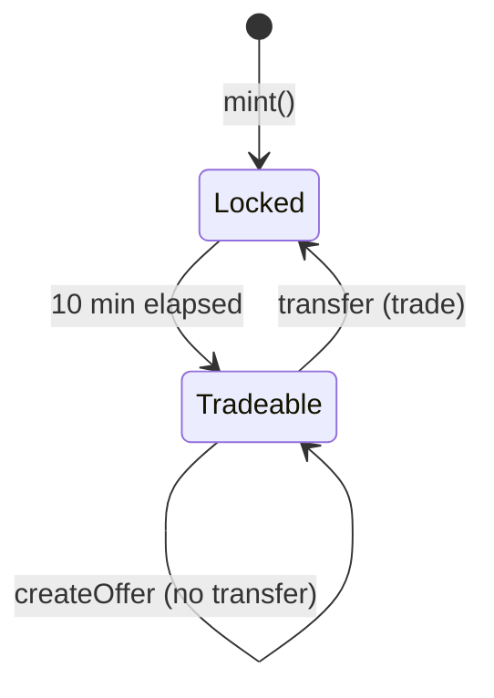

# Smart Contracts Specification — DApp Pokémon Cards Exchange

> Spécification technique complète des smart contracts Solidity.

---

## Table des matières

1. [Vue d'ensemble](#1-vue-densemble)
2. [PokemonCards.sol](#2-pokemoncardssol)
3. [TradeMarket.sol](#3-trademarketsol)
4. [Diagrammes](#4-diagrammes)
5. [Déploiement](#5-déploiement)
6. [Tests](#6-tests)

---

## 1. Vue d'ensemble

### 1.1 Architecture

```
┌─────────────────────────────────────────────────────────────┐
│                      TradeMarket.sol                         │
│  - Gestion des offres d'échange                             │
│  - Cooldown par wallet                                       │
│  - Atomic swap                                               │
└─────────────────────────────────────────────────────────────┘
                              │
                              │ calls
                              ▼
┌─────────────────────────────────────────────────────────────┐
│                     PokemonCards.sol                         │
│  - ERC721 + URIStorage                                       │
│  - Mint avec limite 4 cartes                                 │
│  - Lock 10 min après acquisition                             │
│  - Historique previousOwners                                 │
└─────────────────────────────────────────────────────────────┘
                              │
                              │ inherits
                              ▼
┌─────────────────────────────────────────────────────────────┐
│                   OpenZeppelin v5.x                          │
│  ERC721, ERC721URIStorage, Ownable, ReentrancyGuard         │
└─────────────────────────────────────────────────────────────┘
```

### 1.2 Décisions de design

| Décision | Choix | Justification |
|----------|-------|---------------|
| Token standard | ERC721 | Simplicité, chaque carte unique |
| Ownership tracking | On-chain array | Volume faible, démo claire |
| Cooldown scope | Par wallet | Équité, anti-spam |
| Lock scope | Par token | Stabilité post-acquisition |
| Swap mechanism | Direct transfer | Pas de custody, atomique |

---

## 2. PokemonCards.sol

### 2.1 Informations générales

```solidity
// SPDX-License-Identifier: MIT
pragma solidity ^0.8.20;

/// @title PokemonCards
/// @author 5BLOCK Team
/// @notice ERC721 token representing Pokémon trading cards
/// @dev Implements ownership limits, transfer locks, and provenance tracking
```

### 2.2 Imports et héritage

```solidity
import "@openzeppelin/contracts/token/ERC721/ERC721.sol";
import "@openzeppelin/contracts/token/ERC721/extensions/ERC721URIStorage.sol";
import "@openzeppelin/contracts/access/Ownable.sol";
import "@openzeppelin/contracts/utils/ReentrancyGuard.sol";
```

**Héritage:**
- `ERC721` : Standard NFT
- `ERC721URIStorage` : Stockage tokenURI on-chain
- `Ownable` : Admin functions (optionnel)
- `ReentrancyGuard` : Protection reentrancy

### 2.3 Constantes

```solidity
/// @notice Maximum number of cards a wallet can own
uint256 public constant MAX_CARDS_PER_WALLET = 4;

/// @notice Duration a card is locked after acquisition
uint256 public constant LOCK_DURATION = 10 minutes;

/// @notice Maximum valid Pokémon ID (Gen 1)
uint256 public constant MAX_POKEMON_ID = 151;

/// @notice Minimum valid Pokémon ID
uint256 public constant MIN_POKEMON_ID = 1;
```

### 2.4 Structures de données

```solidity
/// @notice Metadata stored on-chain for each card
/// @param createdAt Timestamp when the card was minted
/// @param lastTransferAt Timestamp of the last transfer
/// @param lockUntil Timestamp until which the card cannot be traded
/// @param pokemonId PokeAPI ID (1-151)
/// @param rarityTier Rarity level (1=Common, 2=Uncommon, 3=Rare, 4=Legendary)
/// @param value Calculated value (HP + Attack + Defense)
struct CardMeta {
    uint256 createdAt;
    uint256 lastTransferAt;
    uint256 lockUntil;
    uint256 pokemonId;
    uint8 rarityTier;
    uint256 value;
}
```

### 2.5 State variables

```solidity
/// @notice Counter for generating unique token IDs
uint256 private _nextTokenId;

/// @notice Mapping from token ID to card metadata
mapping(uint256 => CardMeta) private _cards;

/// @notice Mapping from token ID to list of previous owners
mapping(uint256 => address[]) private _previousOwners;

/// @notice Mapping from address to number of cards owned
mapping(address => uint256) private _ownedCount;

/// @notice Address of the TradeMarket contract (authorized for transfers)
address public tradeMarket;
```

### 2.6 Events

```solidity
/// @notice Emitted when a new card is minted
/// @param owner Address receiving the card
/// @param tokenId Unique identifier of the card
/// @param pokemonId PokeAPI ID of the Pokémon
/// @param rarityTier Rarity tier of the card
event CardMinted(
    address indexed owner,
    uint256 indexed tokenId,
    uint256 pokemonId,
    uint8 rarityTier
);

/// @notice Emitted when a card is transferred
/// @param tokenId Unique identifier of the card
/// @param from Previous owner
/// @param to New owner
event CardTransferred(
    uint256 indexed tokenId,
    address indexed from,
    address indexed to
);

/// @notice Emitted when a card's lock period is set/updated
/// @param tokenId Unique identifier of the card
/// @param until Timestamp until which the card is locked
event CardLocked(
    uint256 indexed tokenId,
    uint256 until
);
```

### 2.7 Errors (Custom errors pour gas efficiency)

```solidity
/// @notice Thrown when trying to mint/receive beyond the 4-card limit
error MaxCardsReached(address wallet, uint256 current);

/// @notice Thrown when pokemonId is outside valid range (1-151)
error InvalidPokemonId(uint256 pokemonId);

/// @notice Thrown when trying to trade a locked card
error CardLocked(uint256 tokenId, uint256 lockUntil);

/// @notice Thrown when querying a non-existent token
error TokenNotFound(uint256 tokenId);

/// @notice Thrown when caller is not authorized
error NotAuthorized(address caller);
```

### 2.8 Modifiers

```solidity
/// @notice Ensures the recipient won't exceed the card limit
/// @param to Address receiving the card
modifier checkLimit(address to) {
    if (_ownedCount[to] >= MAX_CARDS_PER_WALLET) {
        revert MaxCardsReached(to, _ownedCount[to]);
    }
    _;
}

/// @notice Ensures the card is not locked
/// @param tokenId Token to check
modifier notLocked(uint256 tokenId) {
    if (block.timestamp < _cards[tokenId].lockUntil) {
        revert CardLocked(tokenId, _cards[tokenId].lockUntil);
    }
    _;
}
```

### 2.9 Constructor

```solidity
/// @notice Initializes the contract with name and symbol
constructor() ERC721("PokemonCards", "PKMN") Ownable(msg.sender) {}
```

### 2.10 External Functions

#### mint

```solidity
/// @notice Mints a new Pokémon card
/// @dev Caller must have fewer than 4 cards. Card is locked for 10 minutes.
/// @param pokemonId PokeAPI ID (1-151)
/// @param rarityTier Rarity tier (1-4)
/// @param value Calculated value
/// @param uri IPFS URI for metadata
/// @return tokenId The ID of the newly minted token
function mint(
    uint256 pokemonId,
    uint8 rarityTier,
    uint256 value,
    string calldata uri
) external checkLimit(msg.sender) returns (uint256 tokenId) {
    // Validate pokemonId
    if (pokemonId < MIN_POKEMON_ID || pokemonId > MAX_POKEMON_ID) {
        revert InvalidPokemonId(pokemonId);
    }

    // Generate token ID
    tokenId = _nextTokenId++;

    // Store metadata
    _cards[tokenId] = CardMeta({
        createdAt: block.timestamp,
        lastTransferAt: block.timestamp,
        lockUntil: block.timestamp + LOCK_DURATION,
        pokemonId: pokemonId,
        rarityTier: rarityTier,
        value: value
    });

    // Mint token
    _safeMint(msg.sender, tokenId);
    _setTokenURI(tokenId, uri);

    // Update count
    _ownedCount[msg.sender]++;

    emit CardMinted(msg.sender, tokenId, pokemonId, rarityTier);
    emit CardLocked(tokenId, block.timestamp + LOCK_DURATION);
}
```

#### setTradeMarket

```solidity
/// @notice Sets the authorized TradeMarket contract address
/// @dev Only owner can call. Required for TradeMarket to transfer cards.
/// @param _tradeMarket Address of the TradeMarket contract
function setTradeMarket(address _tradeMarket) external onlyOwner {
    tradeMarket = _tradeMarket;
}
```

### 2.11 View Functions

```solidity
/// @notice Returns the metadata for a card
/// @param tokenId Token to query
/// @return CardMeta struct with all metadata
function getCardMeta(uint256 tokenId) external view returns (CardMeta memory) {
    if (!_exists(tokenId)) revert TokenNotFound(tokenId);
    return _cards[tokenId];
}

/// @notice Returns the list of previous owners for a card
/// @param tokenId Token to query
/// @return Array of addresses
function getPreviousOwners(uint256 tokenId) external view returns (address[] memory) {
    if (!_exists(tokenId)) revert TokenNotFound(tokenId);
    return _previousOwners[tokenId];
}

/// @notice Checks if a card is currently locked
/// @param tokenId Token to check
/// @return True if locked, false otherwise
function isLocked(uint256 tokenId) external view returns (bool) {
    return block.timestamp < _cards[tokenId].lockUntil;
}

/// @notice Returns the lock end timestamp for a card
/// @param tokenId Token to query
/// @return Timestamp when lock expires
function getLockUntil(uint256 tokenId) external view returns (uint256) {
    return _cards[tokenId].lockUntil;
}

/// @notice Returns the number of cards owned by an address
/// @param owner Address to query
/// @return Number of cards
function getOwnedCount(address owner) external view returns (uint256) {
    return _ownedCount[owner];
}

/// @notice Checks if token exists
/// @param tokenId Token to check
/// @return True if exists
function exists(uint256 tokenId) external view returns (bool) {
    return _exists(tokenId);
}

/// @notice Internal existence check
function _exists(uint256 tokenId) internal view returns (bool) {
    return _ownerOf(tokenId) != address(0);
}
```

### 2.12 Internal Overrides

```solidity
/// @notice Hook called before any token transfer
/// @dev Updates ownership counts, previous owners, and lock status
function _update(
    address to,
    uint256 tokenId,
    address auth
) internal override returns (address from) {
    from = _ownerOf(tokenId);

    // Skip for mints (from == address(0))
    if (from != address(0)) {
        // Check recipient limit
        if (to != address(0) && _ownedCount[to] >= MAX_CARDS_PER_WALLET) {
            revert MaxCardsReached(to, _ownedCount[to]);
        }

        // Update previous owners
        _previousOwners[tokenId].push(from);

        // Update metadata
        _cards[tokenId].lastTransferAt = block.timestamp;
        _cards[tokenId].lockUntil = block.timestamp + LOCK_DURATION;

        // Update counts
        _ownedCount[from]--;
        if (to != address(0)) {
            _ownedCount[to]++;
        }

        emit CardTransferred(tokenId, from, to);
        emit CardLocked(tokenId, _cards[tokenId].lockUntil);
    }

    return super._update(to, tokenId, auth);
}

/// @notice Override required by Solidity for multiple inheritance
function tokenURI(uint256 tokenId)
    public
    view
    override(ERC721, ERC721URIStorage)
    returns (string memory)
{
    return super.tokenURI(tokenId);
}

/// @notice Override required by Solidity for multiple inheritance
function supportsInterface(bytes4 interfaceId)
    public
    view
    override(ERC721, ERC721URIStorage)
    returns (bool)
{
    return super.supportsInterface(interfaceId);
}
```

---

## 3. TradeMarket.sol

### 3.1 Informations générales

```solidity
// SPDX-License-Identifier: MIT
pragma solidity ^0.8.20;

/// @title TradeMarket
/// @author 5BLOCK Team
/// @notice Marketplace for trading Pokémon cards with cooldown and lock mechanisms
/// @dev Manages trade offers and executes atomic swaps
```

### 3.2 Imports

```solidity
import "./PokemonCards.sol";
import "@openzeppelin/contracts/utils/ReentrancyGuard.sol";
```

### 3.3 Constantes

```solidity
/// @notice Duration between allowed trade actions for a wallet
uint256 public constant COOLDOWN_DURATION = 5 minutes;
```

### 3.4 Structures de données

```solidity
/// @notice Status of a trade offer
enum OfferStatus {
    Open,       // Offer is active and can be accepted
    Cancelled,  // Offer was cancelled by maker
    Accepted    // Offer was accepted and trade completed
}

/// @notice Data structure for a trade offer
/// @param maker Address that created the offer
/// @param makerTokenId Token offered by maker
/// @param takerTokenId Token requested from taker
/// @param status Current status of the offer
/// @param createdAt Timestamp when offer was created
struct Offer {
    address maker;
    uint256 makerTokenId;
    uint256 takerTokenId;
    OfferStatus status;
    uint256 createdAt;
}
```

### 3.5 State variables

```solidity
/// @notice Reference to the PokemonCards contract
PokemonCards public immutable pokemonCards;

/// @notice Counter for generating unique offer IDs
uint256 private _nextOfferId;

/// @notice Mapping from offer ID to offer data
mapping(uint256 => Offer) private _offers;

/// @notice Mapping from address to last action timestamp (for cooldown)
mapping(address => uint256) private _lastActionAt;
```

### 3.6 Events

```solidity
/// @notice Emitted when a new trade offer is created
/// @param offerId Unique identifier of the offer
/// @param maker Address that created the offer
/// @param makerTokenId Token offered
/// @param takerTokenId Token requested
event TradeCreated(
    uint256 indexed offerId,
    address indexed maker,
    uint256 makerTokenId,
    uint256 takerTokenId
);

/// @notice Emitted when a trade offer is accepted
/// @param offerId Unique identifier of the offer
/// @param taker Address that accepted the offer
/// @param maker Address that created the offer
event TradeAccepted(
    uint256 indexed offerId,
    address indexed taker,
    address indexed maker
);

/// @notice Emitted when a trade offer is cancelled
/// @param offerId Unique identifier of the offer
event TradeCancelled(
    uint256 indexed offerId
);
```

### 3.7 Errors

```solidity
/// @notice Thrown when action is attempted before cooldown expires
error CooldownActive(address wallet, uint256 remainingTime);

/// @notice Thrown when trying to trade a locked card
error CardIsLocked(uint256 tokenId);

/// @notice Thrown when caller doesn't own the specified token
error NotTokenOwner(address caller, uint256 tokenId);

/// @notice Thrown when offer is not in Open status
error OfferNotOpen(uint256 offerId, OfferStatus currentStatus);

/// @notice Thrown when caller is not the offer maker
error NotOfferMaker(address caller, address maker);

/// @notice Thrown when maker no longer owns their token
error MakerNoLongerOwnsToken(uint256 tokenId);

/// @notice Thrown when querying non-existent offer
error OfferNotFound(uint256 offerId);

/// @notice Thrown when requested token doesn't exist
error TokenDoesNotExist(uint256 tokenId);
```

### 3.8 Modifiers

```solidity
/// @notice Ensures cooldown period has passed for caller
modifier checkCooldown() {
    uint256 timeSinceLastAction = block.timestamp - _lastActionAt[msg.sender];
    if (timeSinceLastAction < COOLDOWN_DURATION) {
        revert CooldownActive(msg.sender, COOLDOWN_DURATION - timeSinceLastAction);
    }
    _;
    _lastActionAt[msg.sender] = block.timestamp;
}

/// @notice Ensures the specified card is not locked
/// @param tokenId Token to check
modifier cardNotLocked(uint256 tokenId) {
    if (pokemonCards.isLocked(tokenId)) {
        revert CardIsLocked(tokenId);
    }
    _;
}
```

### 3.9 Constructor

```solidity
/// @notice Initializes the contract with the PokemonCards address
/// @param _pokemonCards Address of the PokemonCards contract
constructor(address _pokemonCards) {
    pokemonCards = PokemonCards(_pokemonCards);
}
```

### 3.10 External Functions

#### createOffer

```solidity
/// @notice Creates a new trade offer
/// @dev Caller must own makerTokenId, card must not be locked, cooldown must have passed
/// @param makerTokenId Token the caller is offering
/// @param takerTokenId Token the caller wants in return
/// @return offerId The ID of the newly created offer
function createOffer(
    uint256 makerTokenId,
    uint256 takerTokenId
) external checkCooldown cardNotLocked(makerTokenId) returns (uint256 offerId) {
    // Verify caller owns the token
    if (pokemonCards.ownerOf(makerTokenId) != msg.sender) {
        revert NotTokenOwner(msg.sender, makerTokenId);
    }

    // Verify requested token exists
    if (!pokemonCards.exists(takerTokenId)) {
        revert TokenDoesNotExist(takerTokenId);
    }

    // Create offer
    offerId = _nextOfferId++;
    _offers[offerId] = Offer({
        maker: msg.sender,
        makerTokenId: makerTokenId,
        takerTokenId: takerTokenId,
        status: OfferStatus.Open,
        createdAt: block.timestamp
    });

    emit TradeCreated(offerId, msg.sender, makerTokenId, takerTokenId);
}
```

#### cancelOffer

```solidity
/// @notice Cancels an existing offer
/// @dev Only the maker can cancel. Cooldown applies.
/// @param offerId ID of the offer to cancel
function cancelOffer(uint256 offerId) external checkCooldown {
    Offer storage offer = _offers[offerId];

    // Verify offer exists
    if (offer.maker == address(0)) {
        revert OfferNotFound(offerId);
    }

    // Verify caller is maker
    if (offer.maker != msg.sender) {
        revert NotOfferMaker(msg.sender, offer.maker);
    }

    // Verify offer is open
    if (offer.status != OfferStatus.Open) {
        revert OfferNotOpen(offerId, offer.status);
    }

    // Cancel offer
    offer.status = OfferStatus.Cancelled;

    emit TradeCancelled(offerId);
}
```

#### acceptOffer

```solidity
/// @notice Accepts an existing offer and executes the swap
/// @dev Caller must own takerTokenId. Both cards must not be locked. Cooldown applies.
/// @param offerId ID of the offer to accept
function acceptOffer(uint256 offerId) external nonReentrant checkCooldown {
    Offer storage offer = _offers[offerId];

    // Verify offer exists
    if (offer.maker == address(0)) {
        revert OfferNotFound(offerId);
    }

    // Verify offer is open
    if (offer.status != OfferStatus.Open) {
        revert OfferNotOpen(offerId, offer.status);
    }

    // Verify caller owns the requested token
    if (pokemonCards.ownerOf(offer.takerTokenId) != msg.sender) {
        revert NotTokenOwner(msg.sender, offer.takerTokenId);
    }

    // Verify maker still owns their token
    if (pokemonCards.ownerOf(offer.makerTokenId) != offer.maker) {
        revert MakerNoLongerOwnsToken(offer.makerTokenId);
    }

    // Verify neither card is locked
    if (pokemonCards.isLocked(offer.takerTokenId)) {
        revert CardIsLocked(offer.takerTokenId);
    }
    if (pokemonCards.isLocked(offer.makerTokenId)) {
        revert CardIsLocked(offer.makerTokenId);
    }

    // Update maker's cooldown too
    _lastActionAt[offer.maker] = block.timestamp;

    // Update offer status
    offer.status = OfferStatus.Accepted;

    // Execute atomic swap
    // Note: PokemonCards._update handles limit checks and lock updates
    pokemonCards.transferFrom(offer.maker, msg.sender, offer.makerTokenId);
    pokemonCards.transferFrom(msg.sender, offer.maker, offer.takerTokenId);

    emit TradeAccepted(offerId, msg.sender, offer.maker);
}
```

### 3.11 View Functions

```solidity
/// @notice Returns the details of an offer
/// @param offerId ID of the offer to query
/// @return Offer struct with all details
function getOffer(uint256 offerId) external view returns (Offer memory) {
    if (_offers[offerId].maker == address(0)) {
        revert OfferNotFound(offerId);
    }
    return _offers[offerId];
}

/// @notice Returns the remaining cooldown time for a wallet
/// @param wallet Address to check
/// @return Remaining time in seconds (0 if cooldown has passed)
function getCooldownRemaining(address wallet) external view returns (uint256) {
    uint256 timeSinceLastAction = block.timestamp - _lastActionAt[wallet];
    if (timeSinceLastAction >= COOLDOWN_DURATION) {
        return 0;
    }
    return COOLDOWN_DURATION - timeSinceLastAction;
}

/// @notice Returns the last action timestamp for a wallet
/// @param wallet Address to check
/// @return Timestamp of last action
function getLastActionAt(address wallet) external view returns (uint256) {
    return _lastActionAt[wallet];
}

/// @notice Returns the total number of offers created
/// @return Count of offers
function getOfferCount() external view returns (uint256) {
    return _nextOfferId;
}
```

---

## 4. Diagrammes

### 4.1 Diagramme de séquence : Mint



### 4.2 Diagramme de séquence : Trade



### 4.3 Diagramme d'état : Offer



### 4.4 Diagramme d'état : Card Lock



---

## 5. Déploiement

### 5.1 Script de déploiement

```typescript
// scripts/deploy.ts
import { ethers } from "hardhat";

async function main() {
  const [deployer] = await ethers.getSigners();
  console.log("Deploying with:", deployer.address);

  // Deploy PokemonCards
  const PokemonCards = await ethers.getContractFactory("PokemonCards");
  const pokemonCards = await PokemonCards.deploy();
  await pokemonCards.waitForDeployment();
  const cardsAddress = await pokemonCards.getAddress();
  console.log("PokemonCards deployed to:", cardsAddress);

  // Deploy TradeMarket
  const TradeMarket = await ethers.getContractFactory("TradeMarket");
  const tradeMarket = await TradeMarket.deploy(cardsAddress);
  await tradeMarket.waitForDeployment();
  const marketAddress = await tradeMarket.getAddress();
  console.log("TradeMarket deployed to:", marketAddress);

  // Configure PokemonCards to authorize TradeMarket
  await pokemonCards.setTradeMarket(marketAddress);
  console.log("TradeMarket authorized in PokemonCards");

  // Output addresses for frontend config
  console.log("\n--- Frontend Config ---");
  console.log(`NEXT_PUBLIC_POKEMON_CARDS_ADDRESS=${cardsAddress}`);
  console.log(`NEXT_PUBLIC_TRADE_MARKET_ADDRESS=${marketAddress}`);
}

main().catch((error) => {
  console.error(error);
  process.exitCode = 1;
});
```

### 5.2 Ordre de déploiement

1. Déployer `PokemonCards`
2. Déployer `TradeMarket` avec l'adresse de `PokemonCards`
3. Appeler `pokemonCards.setTradeMarket(tradeMarketAddress)`
4. Vérifier sur Etherscan (optionnel)

### 5.3 Vérification Etherscan

```bash
npx hardhat verify --network sepolia <POKEMON_CARDS_ADDRESS>
npx hardhat verify --network sepolia <TRADE_MARKET_ADDRESS> <POKEMON_CARDS_ADDRESS>
```

---

## 6. Tests

### 6.1 Structure des tests

```
test/
├── PokemonCards.test.ts
│   ├── Deployment
│   ├── Minting
│   │   ├── should mint successfully
│   │   ├── should revert if ownedCount >= 4
│   │   ├── should revert if pokemonId invalid
│   │   └── should set correct metadata
│   ├── Locking
│   │   ├── should lock card after mint
│   │   └── should unlock after 10 minutes
│   └── Transfer
│       ├── should update previousOwners
│       ├── should update lastTransferAt
│       └── should set new lock
│
└── TradeMarket.test.ts
    ├── Deployment
    ├── Create Offer
    │   ├── should create successfully
    │   ├── should revert if not owner
    │   ├── should revert if card locked
    │   └── should revert if cooldown active
    ├── Cancel Offer
    │   ├── should cancel successfully
    │   ├── should revert if not maker
    │   └── should revert if not open
    └── Accept Offer
        ├── should swap successfully
        ├── should revert if card locked
        ├── should revert if maker no longer owns
        ├── should update both users' cooldown
        └── should lock both cards after swap
```

### 6.2 Exemples de tests

```typescript
// test/PokemonCards.test.ts
import { expect } from "chai";
import { ethers } from "hardhat";
import { time } from "@nomicfoundation/hardhat-network-helpers";

describe("PokemonCards", function () {
  let pokemonCards: any;
  let owner: any, user1: any, user2: any;

  beforeEach(async function () {
    [owner, user1, user2] = await ethers.getSigners();
    const PokemonCards = await ethers.getContractFactory("PokemonCards");
    pokemonCards = await PokemonCards.deploy();
  });

  describe("Minting", function () {
    it("should mint successfully when under limit", async function () {
      await pokemonCards.connect(user1).mint(25, 3, 130, "ipfs://test");
      expect(await pokemonCards.getOwnedCount(user1.address)).to.equal(1);
    });

    it("should revert when at limit", async function () {
      // Mint 4 cards
      for (let i = 1; i <= 4; i++) {
        await pokemonCards.connect(user1).mint(i, 1, 100, `ipfs://test${i}`);
      }

      // 5th should fail
      await expect(
        pokemonCards.connect(user1).mint(5, 1, 100, "ipfs://test5")
      ).to.be.revertedWithCustomError(pokemonCards, "MaxCardsReached");
    });

    it("should set lock for 10 minutes", async function () {
      await pokemonCards.connect(user1).mint(25, 3, 130, "ipfs://test");
      expect(await pokemonCards.isLocked(0)).to.be.true;

      await time.increase(10 * 60); // 10 minutes
      expect(await pokemonCards.isLocked(0)).to.be.false;
    });
  });
});

// test/TradeMarket.test.ts
describe("TradeMarket", function () {
  describe("Accept Offer", function () {
    it("should swap cards atomically", async function () {
      // Setup: user1 has card0, user2 has card1, both unlocked
      await time.increase(10 * 60);

      // User1 creates offer
      await tradeMarket.connect(user1).createOffer(0, 1);

      // User2 accepts
      await time.increase(5 * 60); // cooldown
      await tradeMarket.connect(user2).acceptOffer(0);

      // Verify swap
      expect(await pokemonCards.ownerOf(0)).to.equal(user2.address);
      expect(await pokemonCards.ownerOf(1)).to.equal(user1.address);
    });

    it("should lock both cards after swap", async function () {
      await time.increase(10 * 60);
      await tradeMarket.connect(user1).createOffer(0, 1);
      await time.increase(5 * 60);
      await tradeMarket.connect(user2).acceptOffer(0);

      // Both cards should be locked
      expect(await pokemonCards.isLocked(0)).to.be.true;
      expect(await pokemonCards.isLocked(1)).to.be.true;
    });
  });
});
```

### 6.3 Commandes de test

```bash
# Run all tests
npx hardhat test

# Run specific test file
npx hardhat test test/PokemonCards.test.ts

# Run with gas report
REPORT_GAS=true npx hardhat test

# Run with coverage
npx hardhat coverage
```

### 6.4 Couverture cible

| Contrat | Statements | Branches | Functions | Lines |
|---------|------------|----------|-----------|-------|
| PokemonCards | > 90% | > 85% | 100% | > 90% |
| TradeMarket | > 90% | > 85% | 100% | > 90% |
