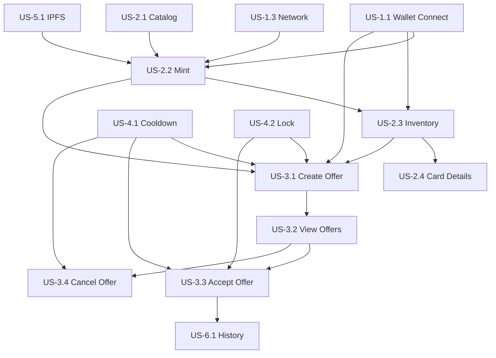

# User Stories Index — DApp Pokémon Cards Exchange

> Vue d'ensemble de toutes les User Stories du projet.

---

## Résumé du projet

**DApp d'échange de cartes Pokémon tokenisées** avec :
- Tokenisation NFT (ERC721) des 151 Pokémon Gen 1
- Marketplace d'échange peer-to-peer (atomic swap)
- Contraintes métier : limite 4 cartes/wallet, cooldown 5min, lock 10min
- Stockage décentralisé IPFS via Pinata
- Frontend Next.js + wagmi/viem

---

## Epics & User Stories

### Epic 1: Gestion du Wallet

| ID | Titre | Priorité | Complexité | Statut |
|----|-------|----------|------------|--------|
| [US-1.1](US-1.1-wallet-connect.md) | Connexion Wallet | Must | Faible | 🔲 |
| [US-1.2](US-1.2-wallet-disconnect.md) | Déconnexion Wallet | Must | Très faible | 🔲 |
| [US-1.3](US-1.3-network-detection.md) | Détection Réseau | Should | Faible | 🔲 |

**Objectif** : Permettre aux utilisateurs de connecter leur wallet MetaMask et gérer leur session.

---

### Epic 2: Gestion des Cartes (Tokens)

| ID | Titre | Priorité | Complexité | Statut |
|----|-------|----------|------------|--------|
| [US-2.1](US-2.1-pokemon-catalog.md) | Consulter le Catalogue | Must | Moyenne | 🔲 |
| [US-2.2](US-2.2-mint-card.md) | Minter une Carte | Must | Élevée | 🔲 |
| [US-2.3](US-2.3-inventory.md) | Consulter mon Inventaire | Must | Moyenne | 🔲 |
| [US-2.4](US-2.4-card-details.md) | Voir Détails Carte | Should | Faible | 🔲 |

**Objectif** : Permettre de créer et gérer des cartes Pokémon tokenisées.

---

### Epic 3: Marketplace d'Échange

| ID | Titre | Priorité | Complexité | Statut |
|----|-------|----------|------------|--------|
| [US-3.1](US-3.1-create-offer.md) | Créer une Offre | Must | Élevée | 🔲 |
| [US-3.2](US-3.2-view-offers.md) | Consulter les Offres | Must | Moyenne | 🔲 |
| [US-3.3](US-3.3-accept-offer.md) | Accepter une Offre | Must | Élevée | 🔲 |
| [US-3.4](US-3.4-cancel-offer.md) | Annuler une Offre | Must | Faible | 🔲 |

**Objectif** : Permettre les échanges de cartes entre utilisateurs.

---

### Epic 4: Contraintes Temporelles

| ID | Titre | Priorité | Complexité | Statut |
|----|-------|----------|------------|--------|
| [US-4.1](US-4.1-cooldown.md) | Cooldown Wallet (5min) | Must | Moyenne | 🔲 |
| [US-4.2](US-4.2-card-lock.md) | Lock Carte (10min) | Must | Moyenne | 🔲 |

**Objectif** : Implémenter les contraintes temporelles imposées par le projet.

---

### Epic 5: IPFS & Métadonnées

| ID | Titre | Priorité | Complexité | Statut |
|----|-------|----------|------------|--------|
| [US-5.1](US-5.1-ipfs-storage.md) | Stockage IPFS | Must | Moyenne | 🔲 |

**Objectif** : Stocker les images et métadonnées sur IPFS via Pinata.

---

### Epic 6: Historique & Traçabilité

| ID | Titre | Priorité | Complexité | Statut |
|----|-------|----------|------------|--------|
| [US-6.1](US-6.1-history.md) | Historique Transactions | Should | Moyenne | 🔲 |

**Objectif** : Permettre la traçabilité des actions et la provenance des cartes.

---

## Matrice de dépendances

---

## Critères de succès (SUPINFO)

Basé sur le document de cadrage :

| Critère | User Stories concernées |
|---------|------------------------|
| Tokenisation avec types/niveaux | US-2.1, US-2.2 |
| Échange entre utilisateurs | US-3.1, US-3.2, US-3.3 |
| Limite 4 cartes/wallet | US-2.2, US-3.3 |
| Cooldown 5 minutes | US-4.1 |
| Lock 10 minutes | US-4.2 |
| Métadonnées IPFS | US-5.1 |
| Tests Hardhat | Toutes US avec smart contract |
| Frontend Next.js | Toutes US frontend |

---

## Fichiers de spécifications

| Document | Description |
|----------|-------------|
| [tech-stack.md](../specs/tech-stack.md) | Stack technique complète |
| [technical-requirements.md](../specs/technical-requirements.md) | Exigences techniques détaillées |
| [smart-contracts.md](../specs/smart-contracts.md) | Spécifications des smart contracts |

---

## Légende des statuts

| Icône | Signification |
|-------|---------------|
| 🔲 | À faire |
| 🔄 | En cours |
| ✅ | Terminé |
| ❌ | Bloqué |

---

## Ordre d'implémentation recommandé

### Phase 1 — Fondations

1. ✅ Configuration projet (Hardhat + Next.js)
2. 🔲 US-5.1 : IPFS Setup (Pinata)
3. 🔲 Smart contracts : PokemonCards + TradeMarket
4. 🔲 US-4.1 + US-4.2 : Contraintes temporelles (dans les contrats)

### Phase 2 — Wallet & Cartes

5. 🔲 US-1.1 : Connexion Wallet
6. 🔲 US-1.2 : Déconnexion Wallet
7. 🔲 US-1.3 : Détection Réseau
8. 🔲 US-2.1 : Catalogue Pokémon
9. 🔲 US-2.2 : Mint Carte
10. 🔲 US-2.3 : Inventaire
11. 🔲 US-2.4 : Détails Carte

### Phase 3 — Marketplace

12. 🔲 US-3.1 : Créer Offre
13. 🔲 US-3.2 : Voir Offres
14. 🔲 US-3.3 : Accepter Offre
15. 🔲 US-3.4 : Annuler Offre

### Phase 4 — Finalisation

16. 🔲 US-6.1 : Historique
17. 🔲 Tests complets
18. 🔲 Documentation

---

## Estimation de complexité totale

| Complexité | Nombre | User Stories |
|------------|--------|--------------|
| Très faible | 1 | US-1.2 |
| Faible | 4 | US-1.1, US-1.3, US-2.4, US-3.4 |
| Moyenne | 6 | US-2.1, US-2.3, US-3.2, US-4.1, US-4.2, US-5.1, US-6.1 |
| Élevée | 3 | US-2.2, US-3.1, US-3.3 |

**Total : 14 User Stories**
