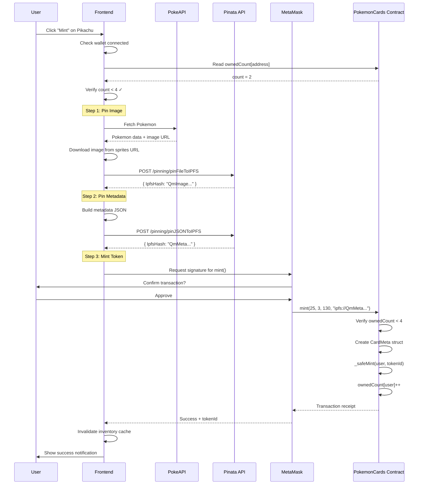

# US-2.2: Minter une Carte Pokémon

> **Epic:** Gestion des Cartes (Tokens)
> **Priorité:** Must Have
> **Complexité:** Élevée

---

## Description

**En tant qu'** utilisateur connecté,
**Je veux** minter une carte Pokémon depuis le catalogue,
**Afin de** l'ajouter à ma collection on-chain.

---

## Contexte & Justification

Le mint est l'action centrale de création de tokens. Quand un utilisateur mint une carte :

1. **Off-chain** : L'image et les métadonnées sont pinnées sur IPFS
2. **On-chain** : Un token ERC721 est créé avec les données et le tokenURI IPFS

Cette opération transforme une donnée PokeAPI en un actif numérique possédé par l'utilisateur.

---

## Critères d'acceptation

| ID | Critère | Vérifié |
|----|---------|---------|
| AC-2.2.1 | Le bouton "Mint" est visible sur chaque carte du catalogue | [ ] |
| AC-2.2.2 | Le bouton est désactivé si l'utilisateur n'est pas connecté | [ ] |
| AC-2.2.3 | Le bouton est désactivé si l'utilisateur possède déjà 4 cartes | [ ] |
| AC-2.2.4 | Un message indique combien de cartes l'utilisateur peut encore minter (ex: "2/4") | [ ] |
| AC-2.2.5 | Avant le mint, l'image est pinnée sur IPFS via Pinata | [ ] |
| AC-2.2.6 | Avant le mint, les métadonnées JSON sont pinnées sur IPFS | [ ] |
| AC-2.2.7 | La transaction est envoyée au contrat et signée via MetaMask | [ ] |
| AC-2.2.8 | Un loader indique les étapes en cours (Pinning image... Pinning metadata... Minting...) | [ ] |
| AC-2.2.9 | Après succès, une notification confirme le mint avec le tokenId | [ ] |
| AC-2.2.10 | Après succès, l'inventaire est mis à jour | [ ] |
| AC-2.2.11 | En cas d'erreur, un message explicite s'affiche | [ ] |
| AC-2.2.12 | La carte mintée est automatiquement verrouillée 10 minutes (lock) | [ ] |

---

## Règles métier

### Limite de possession

- Maximum **4 cartes** par wallet
- Le mint est refusé on-chain si `ownedCount >= 4`
- L'UI doit vérifier avant d'initier la transaction (UX)

### Lock automatique

- Après mint, la carte est verrouillée pendant **10 minutes**
- Pendant cette période, elle ne peut pas être échangée
- Le `lockUntil` est calculé : `block.timestamp + 10 minutes`

### Données du token

| Champ | Source | Description |
|-------|--------|-------------|
| `pokemonId` | PokeAPI | ID du Pokémon (1-151) |
| `rarityTier` | Calculé | 1-4 basé sur HP+ATK+DEF |
| `value` | Calculé | HP + ATK + DEF |
| `tokenURI` | IPFS | `ipfs://Qm...` |

---

## Flow complet du mint



---

## Spécifications techniques

### Hook useMintCard

```typescript
// hooks/useMintCard.ts
import { useWriteContract, useWaitForTransactionReceipt } from 'wagmi';
import { useQueryClient } from '@tanstack/react-query';
import { useState } from 'react';
import { pokemonCardsAbi, pokemonCardsAddress } from '@/lib/contracts';
import { pinImageToIPFS, pinMetadataToIPFS } from '@/lib/pinata';
import { Pokemon } from '@/types/pokemon';
import { buildCardMetadata } from '@/lib/metadata';

type MintStep = 'idle' | 'pinning-image' | 'pinning-metadata' | 'minting' | 'confirming' | 'success' | 'error';

interface UseMintCardReturn {
  mint: (pokemon: Pokemon) => Promise<void>;
  step: MintStep;
  error: Error | null;
  txHash: `0x${string}` | undefined;
  tokenId: bigint | undefined;
  reset: () => void;
}

export function useMintCard(): UseMintCardReturn {
  const [step, setStep] = useState<MintStep>('idle');
  const [error, setError] = useState<Error | null>(null);
  const [tokenId, setTokenId] = useState<bigint>();

  const queryClient = useQueryClient();

  const { writeContractAsync, data: txHash } = useWriteContract();

  const { isSuccess: isConfirmed } = useWaitForTransactionReceipt({
    hash: txHash,
  });

  const mint = async (pokemon: Pokemon) => {
    try {
      setStep('pinning-image');
      setError(null);

      // Step 1: Pin image to IPFS
      const imageCID = await pinImageToIPFS(pokemon.image, pokemon.id);

      setStep('pinning-metadata');

      // Step 2: Build and pin metadata
      const metadata = buildCardMetadata(pokemon, imageCID);
      const metadataCID = await pinMetadataToIPFS(metadata);
      const tokenURI = `ipfs://${metadataCID}`;

      setStep('minting');

      // Step 3: Call contract
      const hash = await writeContractAsync({
        address: pokemonCardsAddress,
        abi: pokemonCardsAbi,
        functionName: 'mint',
        args: [
          BigInt(pokemon.id),
          pokemon.rarityTier,
          BigInt(pokemon.value),
          tokenURI,
        ],
      });

      setStep('confirming');

      // Wait for confirmation handled by useWaitForTransactionReceipt
      // The component should watch isConfirmed

      setStep('success');

      // Invalidate inventory cache
      queryClient.invalidateQueries({ queryKey: ['ownedCards'] });
      queryClient.invalidateQueries({ queryKey: ['ownedCount'] });

    } catch (err) {
      setStep('error');
      setError(err instanceof Error ? err : new Error('Mint failed'));
      throw err;
    }
  };

  const reset = () => {
    setStep('idle');
    setError(null);
    setTokenId(undefined);
  };

  return {
    mint,
    step,
    error,
    txHash,
    tokenId,
    reset,
  };
}
```

### Service Pinata

```typescript
// lib/pinata.ts
const PINATA_JWT = process.env.PINATA_JWT!;
const PINATA_API = 'https://api.pinata.cloud';

// Pin image file to IPFS
export async function pinImageToIPFS(imageUrl: string, pokemonId: number): Promise<string> {
  // Fetch image from PokeAPI
  const imageResponse = await fetch(imageUrl);
  const imageBlob = await imageResponse.blob();

  // Create form data
  const formData = new FormData();
  formData.append('file', imageBlob, `pokemon-${pokemonId}.png`);
  formData.append('pinataMetadata', JSON.stringify({
    name: `Pokemon #${pokemonId} Image`,
  }));

  // Pin to IPFS via API route (to hide JWT)
  const response = await fetch('/api/pin/image', {
    method: 'POST',
    body: formData,
  });

  if (!response.ok) {
    throw new Error('Failed to pin image to IPFS');
  }

  const { IpfsHash } = await response.json();
  return IpfsHash;
}

// Pin JSON metadata to IPFS
export async function pinMetadataToIPFS(metadata: CardMetadata): Promise<string> {
  const response = await fetch('/api/pin/metadata', {
    method: 'POST',
    headers: { 'Content-Type': 'application/json' },
    body: JSON.stringify(metadata),
  });

  if (!response.ok) {
    throw new Error('Failed to pin metadata to IPFS');
  }

  const { IpfsHash } = await response.json();
  return IpfsHash;
}
```

### API Route - Pin Image

```typescript
// app/api/pin/image/route.ts
import { NextRequest, NextResponse } from 'next/server';

const PINATA_JWT = process.env.PINATA_JWT!;

export async function POST(request: NextRequest) {
  try {
    const formData = await request.formData();

    const response = await fetch('https://api.pinata.cloud/pinning/pinFileToIPFS', {
      method: 'POST',
      headers: {
        'Authorization': `Bearer ${PINATA_JWT}`,
      },
      body: formData,
    });

    if (!response.ok) {
      const error = await response.text();
      return NextResponse.json({ error }, { status: response.status });
    }

    const data = await response.json();
    return NextResponse.json(data);

  } catch (error) {
    return NextResponse.json(
      { error: 'Failed to pin image' },
      { status: 500 }
    );
  }
}
```

### API Route - Pin Metadata

```typescript
// app/api/pin/metadata/route.ts
import { NextRequest, NextResponse } from 'next/server';

const PINATA_JWT = process.env.PINATA_JWT!;

export async function POST(request: NextRequest) {
  try {
    const metadata = await request.json();

    const response = await fetch('https://api.pinata.cloud/pinning/pinJSONToIPFS', {
      method: 'POST',
      headers: {
        'Authorization': `Bearer ${PINATA_JWT}`,
        'Content-Type': 'application/json',
      },
      body: JSON.stringify({
        pinataContent: metadata,
        pinataMetadata: {
          name: metadata.name,
        },
      }),
    });

    if (!response.ok) {
      const error = await response.text();
      return NextResponse.json({ error }, { status: response.status });
    }

    const data = await response.json();
    return NextResponse.json(data);

  } catch (error) {
    return NextResponse.json(
      { error: 'Failed to pin metadata' },
      { status: 500 }
    );
  }
}
```

### Metadata Builder

```typescript
// lib/metadata.ts
import { Pokemon } from '@/types/pokemon';

export interface CardMetadata {
  name: string;
  description: string;
  image: string;
  external_url: string;
  attributes: Array<{
    trait_type: string;
    value: string | number;
    display_type?: string;
  }>;
  properties: {
    pokemonId: number;
    rarityTier: number;
    value: number;
    createdAt: number;
    lastTransferAt: number;
    previousOwners: string[];
  };
}

export function buildCardMetadata(pokemon: Pokemon, imageCID: string): CardMetadata {
  const now = Math.floor(Date.now() / 1000);

  return {
    name: `${pokemon.displayName} #${pokemon.id}`,
    description: `A ${pokemon.rarityName} Pokémon trading card. ${pokemon.displayName} is a ${pokemon.types.join('/')} type Pokémon.`,
    image: `ipfs://${imageCID}`,
    external_url: `https://pokeapi.co/api/v2/pokemon/${pokemon.id}`,
    attributes: [
      { trait_type: 'Type', value: pokemon.types[0] },
      { trait_type: 'HP', value: pokemon.stats.hp, display_type: 'number' },
      { trait_type: 'Attack', value: pokemon.stats.attack, display_type: 'number' },
      { trait_type: 'Defense', value: pokemon.stats.defense, display_type: 'number' },
      { trait_type: 'Speed', value: pokemon.stats.speed, display_type: 'number' },
      { trait_type: 'Rarity', value: pokemon.rarityName },
      { trait_type: 'Value', value: pokemon.value, display_type: 'number' },
      { trait_type: 'Generation', value: 1, display_type: 'number' },
    ],
    properties: {
      pokemonId: pokemon.id,
      rarityTier: pokemon.rarityTier,
      value: pokemon.value,
      createdAt: now,
      lastTransferAt: now,
      previousOwners: [],
    },
  };
}
```

### Hook useOwnedCount

```typescript
// hooks/useOwnedCount.ts
import { useReadContract } from 'wagmi';
import { useAccount } from 'wagmi';
import { pokemonCardsAbi, pokemonCardsAddress } from '@/lib/contracts';

export function useOwnedCount() {
  const { address } = useAccount();

  const { data: count, isLoading, error } = useReadContract({
    address: pokemonCardsAddress,
    abi: pokemonCardsAbi,
    functionName: 'getOwnedCount',
    args: address ? [address] : undefined,
    query: {
      enabled: !!address,
    },
  });

  return {
    count: count ?? 0n,
    remaining: 4n - (count ?? 0n),
    canMint: (count ?? 0n) < 4n,
    isLoading,
    error,
  };
}
```

### Composant MintButton

```typescript
// components/MintButton.tsx
'use client';

import { useState } from 'react';
import { useAccount } from 'wagmi';
import { Button } from '@/components/ui/button';
import { useMintCard } from '@/hooks/useMintCard';
import { useOwnedCount } from '@/hooks/useOwnedCount';
import { useNetworkStatus } from '@/hooks/useNetworkStatus';
import { Pokemon } from '@/types/pokemon';
import { Loader2, Check, AlertCircle } from 'lucide-react';
import {
  Dialog,
  DialogContent,
  DialogHeader,
  DialogTitle,
} from '@/components/ui/dialog';

interface MintButtonProps {
  pokemon: Pokemon;
}

const STEP_MESSAGES = {
  'idle': 'Mint Card',
  'pinning-image': 'Uploading image to IPFS...',
  'pinning-metadata': 'Uploading metadata to IPFS...',
  'minting': 'Confirm in MetaMask...',
  'confirming': 'Waiting for confirmation...',
  'success': 'Minted successfully!',
  'error': 'Mint failed',
};

export function MintButton({ pokemon }: MintButtonProps) {
  const { isConnected } = useAccount();
  const { isSupported } = useNetworkStatus();
  const { canMint, remaining } = useOwnedCount();
  const { mint, step, error, txHash, reset } = useMintCard();

  const [showDialog, setShowDialog] = useState(false);

  const isProcessing = !['idle', 'success', 'error'].includes(step);
  const isDisabled = !isConnected || !isSupported || !canMint || isProcessing;

  const handleMint = async () => {
    setShowDialog(true);
    try {
      await mint(pokemon);
    } catch (err) {
      // Error handled in hook
    }
  };

  const handleClose = () => {
    setShowDialog(false);
    reset();
  };

  // Button label
  let buttonLabel = 'Mint Card';
  if (!isConnected) buttonLabel = 'Connect Wallet';
  else if (!isSupported) buttonLabel = 'Wrong Network';
  else if (!canMint) buttonLabel = 'Max Cards (4/4)';
  else if (isProcessing) buttonLabel = STEP_MESSAGES[step];

  return (
    <>
      <Button
        onClick={handleMint}
        disabled={isDisabled}
        className="w-full"
      >
        {isProcessing && <Loader2 className="mr-2 h-4 w-4 animate-spin" />}
        {buttonLabel}
      </Button>

      <Dialog open={showDialog} onOpenChange={setShowDialog}>
        <DialogContent>
          <DialogHeader>
            <DialogTitle>Minting {pokemon.displayName}</DialogTitle>
          </DialogHeader>

          <div className="space-y-4">
            {/* Progress steps */}
            <MintStep
              label="Upload image to IPFS"
              status={getStepStatus(step, 'pinning-image')}
            />
            <MintStep
              label="Upload metadata to IPFS"
              status={getStepStatus(step, 'pinning-metadata')}
            />
            <MintStep
              label="Create token on blockchain"
              status={getStepStatus(step, 'minting')}
            />
            <MintStep
              label="Confirm transaction"
              status={getStepStatus(step, 'confirming')}
            />

            {/* Success */}
            {step === 'success' && (
              <div className="text-center p-4 bg-green-50 rounded-lg">
                <Check className="h-8 w-8 text-green-500 mx-auto mb-2" />
                <p className="font-semibold text-green-700">
                  Successfully minted {pokemon.displayName}!
                </p>
                <p className="text-sm text-green-600 mt-1">
                  Your card is now locked for 10 minutes.
                </p>
                {txHash && (
                  <a
                    href={`https://sepolia.etherscan.io/tx/${txHash}`}
                    target="_blank"
                    rel="noopener noreferrer"
                    className="text-sm text-blue-500 hover:underline mt-2 block"
                  >
                    View transaction
                  </a>
                )}
              </div>
            )}

            {/* Error */}
            {step === 'error' && error && (
              <div className="text-center p-4 bg-red-50 rounded-lg">
                <AlertCircle className="h-8 w-8 text-red-500 mx-auto mb-2" />
                <p className="font-semibold text-red-700">Mint Failed</p>
                <p className="text-sm text-red-600 mt-1">{error.message}</p>
              </div>
            )}

            {/* Close button */}
            {(step === 'success' || step === 'error') && (
              <Button onClick={handleClose} className="w-full">
                Close
              </Button>
            )}
          </div>
        </DialogContent>
      </Dialog>
    </>
  );
}

// Helper component for progress steps
function MintStep({ label, status }: { label: string; status: 'pending' | 'active' | 'done' | 'error' }) {
  return (
    <div className="flex items-center gap-3">
      {status === 'pending' && <div className="h-4 w-4 rounded-full border-2 border-gray-300" />}
      {status === 'active' && <Loader2 className="h-4 w-4 animate-spin text-blue-500" />}
      {status === 'done' && <Check className="h-4 w-4 text-green-500" />}
      {status === 'error' && <AlertCircle className="h-4 w-4 text-red-500" />}
      <span className={status === 'done' ? 'text-green-700' : status === 'active' ? 'text-blue-700' : 'text-gray-500'}>
        {label}
      </span>
    </div>
  );
}

function getStepStatus(currentStep: string, targetStep: string): 'pending' | 'active' | 'done' | 'error' {
  const steps = ['pinning-image', 'pinning-metadata', 'minting', 'confirming'];
  const currentIndex = steps.indexOf(currentStep);
  const targetIndex = steps.indexOf(targetStep);

  if (currentStep === 'error') return 'error';
  if (currentStep === 'success') return 'done';
  if (currentIndex === targetIndex) return 'active';
  if (currentIndex > targetIndex) return 'done';
  return 'pending';
}
```

---

## Interface utilisateur

### Modale de mint

```
┌──────────────────────────────────────────┐
│  Minting Pikachu                     [X] │
├──────────────────────────────────────────┤
│                                          │
│  ✓ Upload image to IPFS                  │
│  ✓ Upload metadata to IPFS               │
│  ◉ Create token on blockchain (spinning) │
│  ○ Confirm transaction                   │
│                                          │
└──────────────────────────────────────────┘

Après succès:
┌──────────────────────────────────────────┐
│  Minting Pikachu                     [X] │
├──────────────────────────────────────────┤
│                                          │
│  ┌────────────────────────────────────┐  │
│  │  ✓ Successfully minted Pikachu!   │  │
│  │    Your card is locked for 10min  │  │
│  │    View transaction →             │  │
│  └────────────────────────────────────┘  │
│                                          │
│  [         Close          ]              │
│                                          │
└──────────────────────────────────────────┘
```

### Indicateur de slots

Sur le header ou la page catalog :
```
┌─────────────────────────────────────────────────────────┐
│  Your Cards: 2/4  [██░░] Can mint 2 more               │
└─────────────────────────────────────────────────────────┘
```

---

## Gestion des erreurs

| Erreur | Message UI | Action |
|--------|-----------|--------|
| `MaxCardsReached` | "You already own 4 cards. Trade one to mint more." | Bouton désactivé |
| `InvalidPokemonId` | "Invalid Pokémon ID." | Ne devrait pas arriver |
| User rejected tx | "Transaction cancelled." | Permettre de réessayer |
| Network error | "Network error. Please try again." | Bouton retry |
| Pinata error | "Failed to upload to IPFS. Please try again." | Bouton retry |

---

## Scénarios de test

### Tests manuels

| # | Scénario | Étapes | Résultat attendu |
|---|----------|--------|------------------|
| 1 | Mint réussi | 1. Connecté, 0 cartes 2. Cliquer Mint | Token créé, inventaire +1 |
| 2 | Mint à la limite | 1. 3 cartes 2. Mint | Token créé, inventaire = 4 |
| 3 | Mint au-delà limite | 1. 4 cartes 2. Cliquer Mint | Bouton désactivé |
| 4 | Mint annulé | 1. Cliquer Mint 2. Rejeter dans MetaMask | Message "cancelled" |
| 5 | Lock vérifié | 1. Mint une carte 2. Voir inventaire | Carte affiche "Locked 10min" |

### Tests Hardhat

```typescript
describe("Mint", () => {
  it("should mint successfully when under limit", async () => {
    const tx = await pokemonCards.connect(user1).mint(
      25,  // Pikachu
      3,   // Rare
      130, // value
      "ipfs://QmTest"
    );
    await tx.wait();

    expect(await pokemonCards.ownerOf(0)).to.equal(user1.address);
    expect(await pokemonCards.getOwnedCount(user1.address)).to.equal(1);
  });

  it("should revert when at limit", async () => {
    // Mint 4 cards
    for (let i = 1; i <= 4; i++) {
      await pokemonCards.connect(user1).mint(i, 1, 100, `ipfs://test${i}`);
    }

    // 5th should fail
    await expect(
      pokemonCards.connect(user1).mint(5, 1, 100, "ipfs://test5")
    ).to.be.revertedWithCustomError(pokemonCards, "MaxCardsReached");
  });

  it("should set lock for 10 minutes after mint", async () => {
    await pokemonCards.connect(user1).mint(25, 3, 130, "ipfs://test");

    expect(await pokemonCards.isLocked(0)).to.be.true;

    // Advance time by 10 minutes
    await time.increase(10 * 60);

    expect(await pokemonCards.isLocked(0)).to.be.false;
  });
});
```

---

## Dépendances

### Dépendances fonctionnelles
- US-1.1 (Wallet Connect) - doit être connecté
- US-1.3 (Network Detection) - doit être sur le bon réseau
- US-2.1 (Catalog) - source des données Pokémon

### Dépendances techniques
- Contrat `PokemonCards.sol` déployé
- Compte Pinata avec JWT configuré
- Variables d'environnement configurées

### Bloque
- US-2.3 (Inventory) - les cartes mintées apparaissent dans l'inventaire
- US-3.x (Trade) - les cartes mintées peuvent être échangées (après lock)

---

## Coûts estimés

| Opération | Gas estimé | Coût @ 30 gwei |
|-----------|------------|----------------|
| mint() | ~150,000 | ~0.0045 ETH |
| Pin image (Pinata) | - | Free tier |
| Pin JSON (Pinata) | - | Free tier |

---

## Définition of Done

- [ ] Hook `useMintCard` avec gestion des étapes
- [ ] API routes pour Pinata (image + metadata)
- [ ] Composant `MintButton` avec modale de progression
- [ ] Métadonnées générées au format standard
- [ ] Hook `useOwnedCount` pour vérifier la limite
- [ ] Gestion des erreurs avec messages clairs
- [ ] Tests Hardhat pour le contrat mint()
- [ ] Tests manuels end-to-end passés
- [ ] Fonctionne sur Hardhat local et Sepolia
