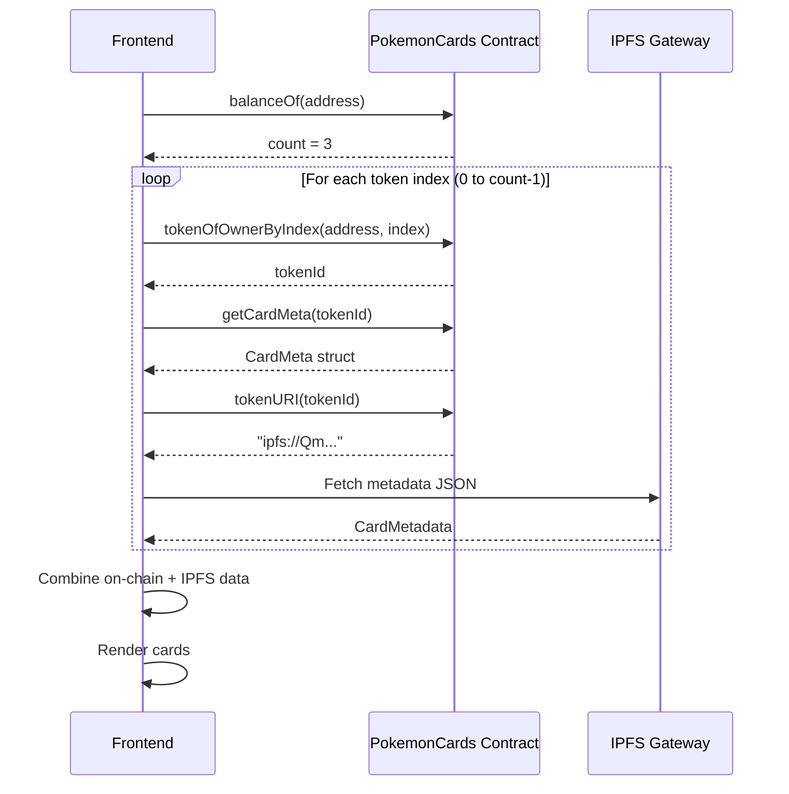

# US-2.3: Consulter mon Inventaire

> **Epic:** Gestion des Cartes (Tokens)
> **Priorité:** Must Have
> **Complexité:** Moyenne

---

## Description

**En tant qu'** utilisateur connecté,
**Je veux** voir toutes mes cartes Pokémon,
**Afin de** gérer ma collection et initier des échanges.

---

## Contexte & Justification

L'inventaire est le tableau de bord personnel de l'utilisateur. Il affiche toutes les cartes qu'il possède avec :
- Les informations visuelles (image, nom, type)
- Les données on-chain (rareté, valeur, timestamps)
- L'état actuel (verrouillé ou disponible pour l'échange)

Cette page est essentielle pour que l'utilisateur puisse décider quelle carte proposer en échange.

---

## Critères d'acceptation

| ID | Critère | Vérifié |
|----|---------|---------|
| AC-2.3.1 | La page `/inventory` est accessible depuis la navigation | [ ] |
| AC-2.3.2 | La page nécessite une connexion wallet (redirect si non connecté) | [ ] |
| AC-2.3.3 | Toutes les cartes du wallet connecté sont listées | [ ] |
| AC-2.3.4 | Chaque carte affiche : image, nom, type, rareté, valeur | [ ] |
| AC-2.3.5 | L'état de lock est visible (icône cadenas + temps restant si locked) | [ ] |
| AC-2.3.6 | Le nombre total de cartes est affiché (ex: "3/4 cartes") | [ ] |
| AC-2.3.7 | Un message s'affiche si l'inventaire est vide avec lien vers /catalog | [ ] |
| AC-2.3.8 | Les métadonnées sont chargées depuis IPFS via tokenURI | [ ] |
| AC-2.3.9 | Un skeleton loader s'affiche pendant le chargement | [ ] |
| AC-2.3.10 | Click sur une carte ouvre les détails (US-2.4) | [ ] |
| AC-2.3.11 | Bouton "Propose Trade" visible sur les cartes non verrouillées | [ ] |

---

## Règles métier

### Données affichées par carte

| Donnée | Source | Description |
|--------|--------|-------------|
| Image | IPFS (via tokenURI) | Artwork du Pokémon |
| Nom | IPFS metadata | Ex: "Pikachu #25" |
| Type(s) | IPFS metadata | Ex: Electric |
| Rareté | On-chain (rarityTier) | Common/Uncommon/Rare/Legendary |
| Valeur | On-chain (value) | HP + ATK + DEF |
| Token ID | On-chain | Identifiant unique |
| Créé le | On-chain (createdAt) | Date de mint |
| Lock status | On-chain (lockUntil) | Locked/Available |

### Calcul du lock status

```typescript
const isLocked = lockUntil > Math.floor(Date.now() / 1000);
const remainingLock = isLocked ? lockUntil - Math.floor(Date.now() / 1000) : 0;
```

---

## Spécifications techniques

### Flow de chargement



### Hook useOwnedCards

```typescript
// hooks/useOwnedCards.ts
import { useAccount, useReadContracts } from 'wagmi';
import { useQueries } from '@tanstack/react-query';
import { pokemonCardsAbi, pokemonCardsAddress } from '@/lib/contracts';
import { fetchIPFSMetadata } from '@/lib/ipfs';

interface OwnedCard {
  tokenId: bigint;
  // On-chain data
  pokemonId: number;
  rarityTier: number;
  value: number;
  createdAt: number;
  lastTransferAt: number;
  lockUntil: number;
  // Computed
  isLocked: boolean;
  lockRemaining: number;
  // IPFS metadata
  metadata: CardMetadata | null;
}

export function useOwnedCards() {
  const { address } = useAccount();

  // Step 1: Get balance (number of tokens)
  const { data: balance } = useReadContract({
    address: pokemonCardsAddress,
    abi: pokemonCardsAbi,
    functionName: 'balanceOf',
    args: address ? [address] : undefined,
    query: { enabled: !!address },
  });

  // Step 2: Get all token IDs
  const tokenIdQueries = useReadContracts({
    contracts: Array.from({ length: Number(balance ?? 0) }, (_, i) => ({
      address: pokemonCardsAddress,
      abi: pokemonCardsAbi,
      functionName: 'tokenOfOwnerByIndex',
      args: [address!, BigInt(i)],
    })),
    query: { enabled: !!address && !!balance && balance > 0n },
  });

  const tokenIds = tokenIdQueries.data
    ?.map(r => r.result as bigint)
    .filter(Boolean) ?? [];

  // Step 3: Get card metadata for each token
  const cardMetaQueries = useReadContracts({
    contracts: tokenIds.map(tokenId => ({
      address: pokemonCardsAddress,
      abi: pokemonCardsAbi,
      functionName: 'getCardMeta',
      args: [tokenId],
    })),
    query: { enabled: tokenIds.length > 0 },
  });

  // Step 4: Get tokenURIs for each token
  const tokenUriQueries = useReadContracts({
    contracts: tokenIds.map(tokenId => ({
      address: pokemonCardsAddress,
      abi: pokemonCardsAbi,
      functionName: 'tokenURI',
      args: [tokenId],
    })),
    query: { enabled: tokenIds.length > 0 },
  });

  // Step 5: Fetch IPFS metadata for each tokenURI
  const metadataQueries = useQueries({
    queries: (tokenUriQueries.data ?? []).map((result, i) => ({
      queryKey: ['ipfs-metadata', result.result],
      queryFn: () => fetchIPFSMetadata(result.result as string),
      enabled: !!result.result,
      staleTime: Infinity,
    })),
  });

  // Combine all data
  const cards: OwnedCard[] = tokenIds.map((tokenId, i) => {
    const cardMeta = cardMetaQueries.data?.[i]?.result as any;
    const metadata = metadataQueries[i]?.data ?? null;
    const now = Math.floor(Date.now() / 1000);

    return {
      tokenId,
      pokemonId: Number(cardMeta?.pokemonId ?? 0),
      rarityTier: Number(cardMeta?.rarityTier ?? 1),
      value: Number(cardMeta?.value ?? 0),
      createdAt: Number(cardMeta?.createdAt ?? 0),
      lastTransferAt: Number(cardMeta?.lastTransferAt ?? 0),
      lockUntil: Number(cardMeta?.lockUntil ?? 0),
      isLocked: Number(cardMeta?.lockUntil ?? 0) > now,
      lockRemaining: Math.max(0, Number(cardMeta?.lockUntil ?? 0) - now),
      metadata,
    };
  });

  const isLoading = tokenIdQueries.isLoading ||
    cardMetaQueries.isLoading ||
    tokenUriQueries.isLoading ||
    metadataQueries.some(q => q.isLoading);

  return {
    cards,
    count: cards.length,
    maxCards: 4,
    isLoading,
    isEmpty: !isLoading && cards.length === 0,
  };
}
```

### Service IPFS Fetch

```typescript
// lib/ipfs.ts
const IPFS_GATEWAYS = [
  'https://gateway.pinata.cloud/ipfs/',
  'https://ipfs.io/ipfs/',
  'https://cloudflare-ipfs.com/ipfs/',
];

export async function fetchIPFSMetadata(tokenURI: string): Promise<CardMetadata> {
  const cid = tokenURI.replace('ipfs://', '');

  for (const gateway of IPFS_GATEWAYS) {
    try {
      const response = await fetch(`${gateway}${cid}`, {
        signal: AbortSignal.timeout(10000), // 10s timeout
      });
      if (response.ok) {
        return await response.json();
      }
    } catch (e) {
      console.warn(`Gateway ${gateway} failed, trying next...`);
      continue;
    }
  }

  throw new Error(`Failed to fetch metadata from IPFS: ${cid}`);
}
```

### Composant InventoryCard

```typescript
// components/InventoryCard.tsx
'use client';

import Image from 'next/image';
import { OwnedCard } from '@/hooks/useOwnedCards';
import { Card, CardContent, CardFooter } from '@/components/ui/card';
import { Badge } from '@/components/ui/badge';
import { Button } from '@/components/ui/button';
import { Lock, Unlock, ArrowRightLeft } from 'lucide-react';
import { TypeBadge } from './TypeBadge';
import { RarityBadge } from './RarityBadge';
import { formatDistanceToNow } from 'date-fns';

interface InventoryCardProps {
  card: OwnedCard;
  onViewDetails?: () => void;
  onProposeTrade?: () => void;
}

export function InventoryCard({ card, onViewDetails, onProposeTrade }: InventoryCardProps) {
  const { metadata, isLocked, lockRemaining, tokenId, rarityTier, value } = card;

  // Format lock time remaining
  const formatLockTime = (seconds: number) => {
    const minutes = Math.floor(seconds / 60);
    const secs = seconds % 60;
    return `${minutes}:${secs.toString().padStart(2, '0')}`;
  };

  return (
    <Card
      className="overflow-hidden hover:shadow-lg transition-shadow cursor-pointer"
      onClick={onViewDetails}
    >
      {/* Image */}
      <div className="relative aspect-square bg-gradient-to-br from-gray-100 to-gray-200">
        {metadata?.image && (
          <Image
            src={metadata.image.replace('ipfs://', 'https://gateway.pinata.cloud/ipfs/')}
            alt={metadata?.name ?? 'Pokemon Card'}
            fill
            className="object-contain p-4"
          />
        )}

        {/* Rarity badge */}
        <RarityBadge tier={rarityTier} className="absolute top-2 right-2" />

        {/* Lock indicator */}
        <div className="absolute top-2 left-2">
          {isLocked ? (
            <Badge variant="destructive" className="flex items-center gap-1">
              <Lock className="h-3 w-3" />
              {formatLockTime(lockRemaining)}
            </Badge>
          ) : (
            <Badge variant="secondary" className="flex items-center gap-1">
              <Unlock className="h-3 w-3" />
              Available
            </Badge>
          )}
        </div>
      </div>

      {/* Content */}
      <CardContent className="p-4">
        <div className="flex items-center justify-between mb-2">
          <h3 className="font-bold text-lg truncate">
            {metadata?.name ?? `Card #${tokenId}`}
          </h3>
          <span className="text-xs text-muted-foreground">
            #{tokenId.toString()}
          </span>
        </div>

        {/* Types */}
        <div className="flex gap-1 mb-3">
          {metadata?.attributes
            ?.filter(a => a.trait_type === 'Type')
            .map(a => (
              <TypeBadge key={a.value} type={String(a.value).toLowerCase()} />
            ))}
        </div>

        {/* Stats */}
        <div className="grid grid-cols-3 gap-2 text-sm text-center">
          {['HP', 'Attack', 'Defense'].map(stat => {
            const attr = metadata?.attributes?.find(a => a.trait_type === stat);
            return (
              <div key={stat}>
                <div className="text-muted-foreground text-xs">{stat.slice(0, 3).toUpperCase()}</div>
                <div className="font-semibold">{attr?.value ?? '-'}</div>
              </div>
            );
          })}
        </div>

        {/* Value */}
        <div className="mt-3 pt-3 border-t flex justify-between text-sm">
          <span className="text-muted-foreground">Value</span>
          <span className="font-semibold">{value}</span>
        </div>
      </CardContent>

      {/* Actions */}
      <CardFooter className="p-4 pt-0">
        <Button
          className="w-full"
          variant={isLocked ? 'secondary' : 'default'}
          disabled={isLocked}
          onClick={(e) => {
            e.stopPropagation();
            onProposeTrade?.();
          }}
        >
          <ArrowRightLeft className="h-4 w-4 mr-2" />
          {isLocked ? 'Locked' : 'Propose Trade'}
        </Button>
      </CardFooter>
    </Card>
  );
}
```

### Page Inventory

```typescript
// app/inventory/page.tsx
'use client';

import { useAccount } from 'wagmi';
import { useRouter } from 'next/navigation';
import { useEffect } from 'react';
import { useOwnedCards } from '@/hooks/useOwnedCards';
import { InventoryCard } from '@/components/InventoryCard';
import { InventoryCardSkeleton } from '@/components/InventoryCardSkeleton';
import { Button } from '@/components/ui/button';
import { Package, ArrowRight } from 'lucide-react';
import Link from 'next/link';

export default function InventoryPage() {
  const { isConnected, isDisconnected } = useAccount();
  const router = useRouter();
  const { cards, count, maxCards, isLoading, isEmpty } = useOwnedCards();

  // Redirect if not connected
  useEffect(() => {
    if (isDisconnected) {
      router.push('/');
    }
  }, [isDisconnected, router]);

  if (!isConnected) {
    return null; // Will redirect
  }

  return (
    <div className="container mx-auto py-8">
      {/* Header */}
      <div className="flex items-center justify-between mb-6">
        <div>
          <h1 className="text-3xl font-bold">My Cards</h1>
          <p className="text-muted-foreground">
            {count} / {maxCards} cards in your collection
          </p>
        </div>

        {/* Progress bar */}
        <div className="flex items-center gap-4">
          <div className="w-32 h-2 bg-gray-200 rounded-full overflow-hidden">
            <div
              className="h-full bg-primary transition-all"
              style={{ width: `${(count / maxCards) * 100}%` }}
            />
          </div>
          <span className="text-sm font-medium">{count}/{maxCards}</span>
        </div>
      </div>

      {/* Loading */}
      {isLoading && (
        <div className="grid grid-cols-1 sm:grid-cols-2 md:grid-cols-3 lg:grid-cols-4 gap-6">
          {Array.from({ length: 4 }).map((_, i) => (
            <InventoryCardSkeleton key={i} />
          ))}
        </div>
      )}

      {/* Empty state */}
      {isEmpty && (
        <div className="text-center py-16">
          <Package className="h-16 w-16 text-muted-foreground mx-auto mb-4" />
          <h2 className="text-xl font-semibold mb-2">No cards yet</h2>
          <p className="text-muted-foreground mb-6">
            Start your collection by minting your first Pokémon card!
          </p>
          <Link href="/catalog">
            <Button>
              Browse Catalog
              <ArrowRight className="h-4 w-4 ml-2" />
            </Button>
          </Link>
        </div>
      )}

      {/* Cards grid */}
      {!isLoading && !isEmpty && (
        <div className="grid grid-cols-1 sm:grid-cols-2 md:grid-cols-3 lg:grid-cols-4 gap-6">
          {cards.map(card => (
            <InventoryCard
              key={card.tokenId.toString()}
              card={card}
              onViewDetails={() => router.push(`/card/${card.tokenId}`)}
              onProposeTrade={() => router.push(`/trade/create?tokenId=${card.tokenId}`)}
            />
          ))}
        </div>
      )}

      {/* Mint more prompt */}
      {!isLoading && count > 0 && count < maxCards && (
        <div className="mt-8 p-4 bg-muted rounded-lg text-center">
          <p className="text-muted-foreground mb-2">
            You can mint {maxCards - count} more card{maxCards - count > 1 ? 's' : ''}!
          </p>
          <Link href="/catalog">
            <Button variant="outline">
              Browse Catalog
            </Button>
          </Link>
        </div>
      )}
    </div>
  );
}
```

---

## Interface utilisateur

### Layout de la page

```
┌─────────────────────────────────────────────────────────────┐
│  My Cards                                   [████░░] 3/4    │
│  3 / 4 cards in your collection                             │
├─────────────────────────────────────────────────────────────┤
│  ┌──────────────┐  ┌──────────────┐  ┌──────────────┐      │
│  │ 🔒 8:42      │  │ 🔓 Available │  │ 🔓 Available │      │
│  │ [Pikachu]    │  │ [Bulbasaur]  │  │ [Charmander] │      │
│  │ ⚡ Electric  │  │ 🌿 Grass     │  │ 🔥 Fire      │      │
│  │              │  │              │  │              │      │
│  │ HP  ATK  DEF │  │ HP  ATK  DEF │  │ HP  ATK  DEF │      │
│  │ 35  55   40  │  │ 45  49   49  │  │ 39  52   43  │      │
│  │              │  │              │  │              │      │
│  │ Value: 130   │  │ Value: 143   │  │ Value: 134   │      │
│  │ [Locked    ] │  │ [Trade     ] │  │ [Trade     ] │      │
│  └──────────────┘  └──────────────┘  └──────────────┘      │
│                                                             │
│  ┌─────────────────────────────────────────────────────┐   │
│  │  You can mint 1 more card!  [Browse Catalog]        │   │
│  └─────────────────────────────────────────────────────┘   │
└─────────────────────────────────────────────────────────────┘
```

### État vide

```
┌─────────────────────────────────────────────────────────────┐
│  My Cards                                   [░░░░░░] 0/4    │
├─────────────────────────────────────────────────────────────┤
│                                                             │
│                        📦                                   │
│                                                             │
│                   No cards yet                              │
│                                                             │
│     Start your collection by minting your first            │
│              Pokémon card!                                  │
│                                                             │
│                 [Browse Catalog →]                          │
│                                                             │
└─────────────────────────────────────────────────────────────┘
```

---

## Scénarios de test

| # | Scénario | Étapes | Résultat attendu |
|---|----------|--------|------------------|
| 1 | Inventaire vide | 1. Connecter wallet sans cartes | Message "No cards" + lien catalog |
| 2 | Affichage cartes | 1. Connecter wallet avec 2 cartes | 2 cartes affichées avec détails |
| 3 | Lock status | 1. Mint une carte 2. Voir inventaire | Badge "Locked" avec countdown |
| 4 | Lock expired | 1. Attendre 10 min après mint | Badge "Available" |
| 5 | Click détails | 1. Cliquer sur une carte | Navigation vers /card/{tokenId} |
| 6 | Non connecté | 1. Aller sur /inventory sans wallet | Redirection vers / |
| 7 | Metadata IPFS | 1. Voir une carte | Image + nom chargés depuis IPFS |

---

## Dépendances

### Dépendances fonctionnelles
- US-1.1 (Wallet Connect) - doit être connecté
- US-2.2 (Mint) - doit avoir minté des cartes

### Bloque
- US-2.4 (Card Details) - click sur une carte
- US-3.1 (Create Trade) - bouton "Propose Trade"

---

## Définition of Done

- [ ] Hook `useOwnedCards` avec lecture on-chain + IPFS
- [ ] Service `fetchIPFSMetadata` avec fallback gateways
- [ ] Composant `InventoryCard` avec lock status
- [ ] Page `/inventory` avec grille responsive
- [ ] État vide avec CTA vers catalog
- [ ] Protection de route (redirect si non connecté)
- [ ] Skeleton loaders
- [ ] Tests manuels passés
