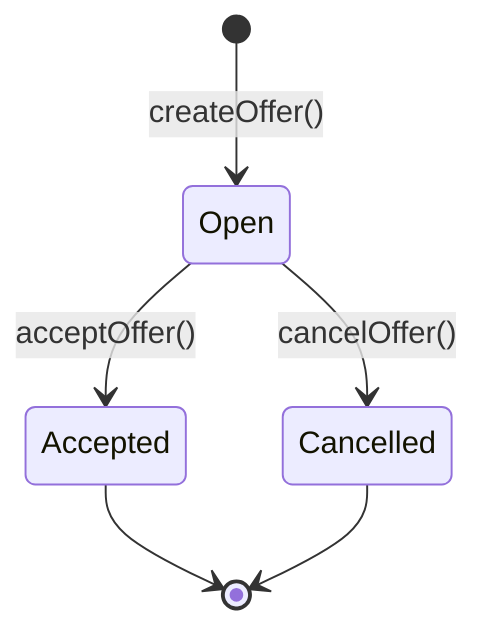

# Trade

Peer-to-peer marketplace for trading Pokemon cards.

---

## Overview

The Trade feature enables direct card swaps between collectors. No intermediary, no fees beyond gas - just atomic peer-to-peer exchanges.

---

## How Trading Works

### 1. Create an Offer

To trade, you create an offer specifying:
- **Your card** (what you're giving)
- **Wanted card** (what you want in return)

### 2. Wait for Acceptance

Your offer is visible to all users. The owner of the card you want can accept it.

### 3. Atomic Swap

When accepted, both cards transfer simultaneously:
- Your card goes to them
- Their card comes to you
- All in one transaction

---

## Offer Lifecycle

| Status | Description |
|--------|-------------|
| **Open** | Active offer, can be accepted or cancelled |
| **Accepted** | Trade completed, cards exchanged |
| **Cancelled** | Offer withdrawn by maker |

---

## Cooldown Mechanism

### 5-Minute Cooldown

After any trade action, you must wait **5 minutes** before the next action.

**Actions that trigger cooldown:**
- Creating an offer
- Cancelling an offer
- Accepting an offer

**Why cooldowns?**

- **Prevents Spam** - Can't flood marketplace with offers
- **Reduces DoS Risk** - Limits contract interaction rate
- **Encourages Thoughtful Trading** - No impulse spam

### Checking Cooldown

The UI shows your cooldown status. If you try to act during cooldown, the transaction will revert.

---

## Lock Mechanism

### 10-Minute Lock

After receiving a card (via mint or trade), it's locked for **10 minutes**.

**Why locks?**

- **Prevents Rapid Arbitrage** - Can't instantly flip a card
- **No Flash Loan Exploits** - Can't borrow → trade → repay in one tx
- **Fair Market** - Everyone has same holding period

### Lock + Trade Interaction

You cannot:
- Create an offer with a locked card
- Accept an offer if your card is locked

The trade will revert if either card is locked.

---

## Creating an Offer

### Steps

1. **Go to Trade page**
2. **Click "Create Offer"**
3. **Select your card** (from unlocked cards in inventory)
4. **Select wanted card** (any card that exists)
5. **Confirm transaction** in MetaMask
6. **Wait for confirmation**

### Requirements

- Your card must not be locked
- You must not be in cooldown
- You must own the card you're offering

---

## Accepting an Offer

### Steps

1. **Browse open offers**
2. **Find an offer for a card you own**
3. **Click "Accept"**
4. **Confirm transaction** in MetaMask
5. **Cards swap instantly**

### Requirements

- You own the requested card
- Your card is not locked
- Maker's card is not locked
- You're not in cooldown

---

## Cancelling an Offer

Changed your mind? Cancel anytime:

1. **Go to your offers**
2. **Click "Cancel" on the offer**
3. **Confirm transaction**

Note: Cancelling triggers cooldown.

---

## Gas Costs

| Action | Approximate Gas |
|--------|-----------------|
| Create Offer | ~100k gas |
| Cancel Offer | ~50k gas |
| Accept Offer | ~200k gas |

Accept costs more because it transfers two NFTs.

---

## Safety Features

### Atomic Swaps

Both transfers happen in one transaction. Either:
- Both cards transfer successfully, OR
- The entire transaction reverts

No risk of sending your card and not receiving one back.

### On-Chain Verification

All offers are stored on-chain. You can verify:
- Offer exists
- Status is Open
- Maker owns the offered card
- Cards aren't locked
