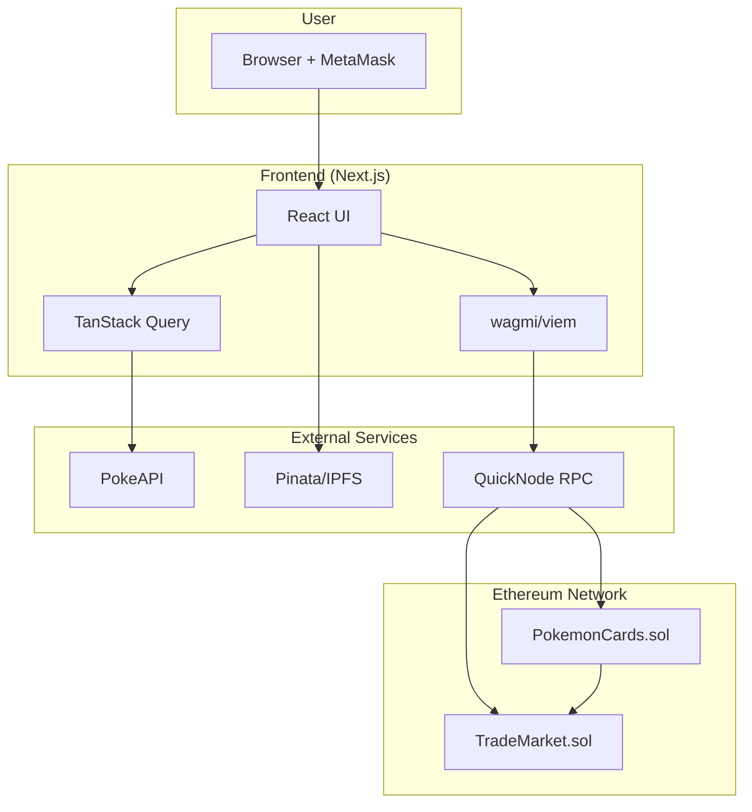
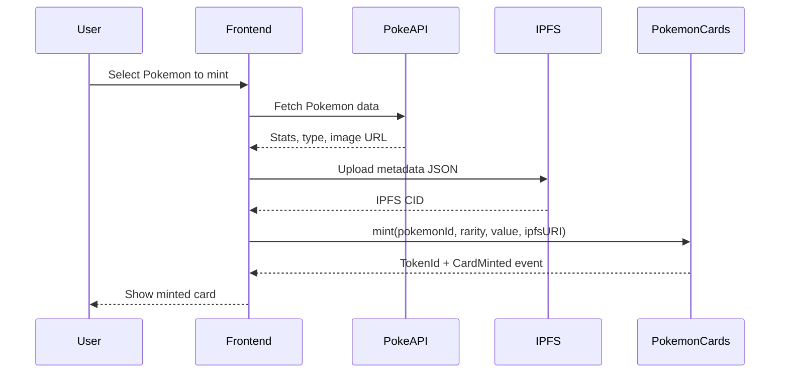
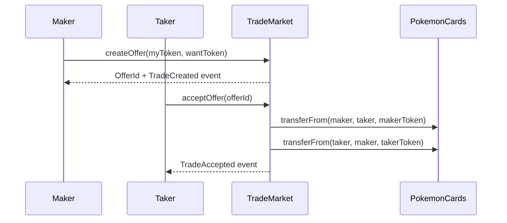

# Infrastructure

How 5BLOCK components work together.

---

## System Architecture



---

## Component Responsibilities

### Frontend (Next.js)

- **UI Layer**: React components for catalog, inventory, trade, history
- **Wallet Integration**: MetaMask connection via wagmi
- **State Management**: TanStack Query for caching and async state
- **Data Fetching**: PokeAPI for Pokemon stats, IPFS for metadata

### Smart Contracts

- **PokemonCards.sol**: ERC-721 NFT contract managing card ownership, minting, locks
- **TradeMarket.sol**: Marketplace contract handling trade offers and atomic swaps

### External Services

- **QuickNode**: RPC endpoint for blockchain communication
- **PokeAPI**: Source of Pokemon data (stats, types, sprites)
- **Pinata/IPFS**: Decentralized storage for NFT metadata and images

---

## Data Flow

### Minting a Card



### Trading Cards



---

## Security Model

### On-Chain Security

- **ReentrancyGuard**: Prevents reentrancy attacks on mint and trade
- **Ownership Checks**: Only token owners can create offers or transfer
- **Lock Mechanism**: 10-minute lock prevents rapid arbitrage
- **Cooldown**: 5-minute cooldown between trade actions

### Off-Chain Security

- **MetaMask**: User controls private keys, never exposed to app
- **IPFS**: Immutable content addressing ensures metadata integrity
- **No Backend**: No centralized server means no single point of compromise

---

## Deployment Architecture

### Local Development

```
┌─────────────────┐     ┌──────────────────┐
│  Next.js Dev    │────▶│  Hardhat Node    │
│  localhost:3000 │     │  localhost:8545  │
└─────────────────┘     └──────────────────┘
```

### Production (Sepolia)

```
┌─────────────────┐     ┌──────────────────┐     ┌─────────────────┐
│  Next.js App    │────▶│  QuickNode RPC   │────▶│  Sepolia Chain  │
│  (Vercel/etc)   │     │                  │     │                 │
└─────────────────┘     └──────────────────┘     └─────────────────┘
```
