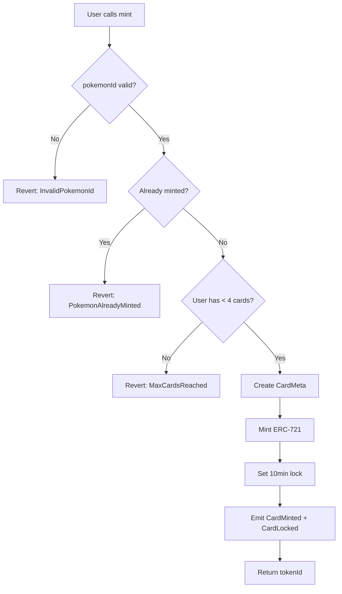
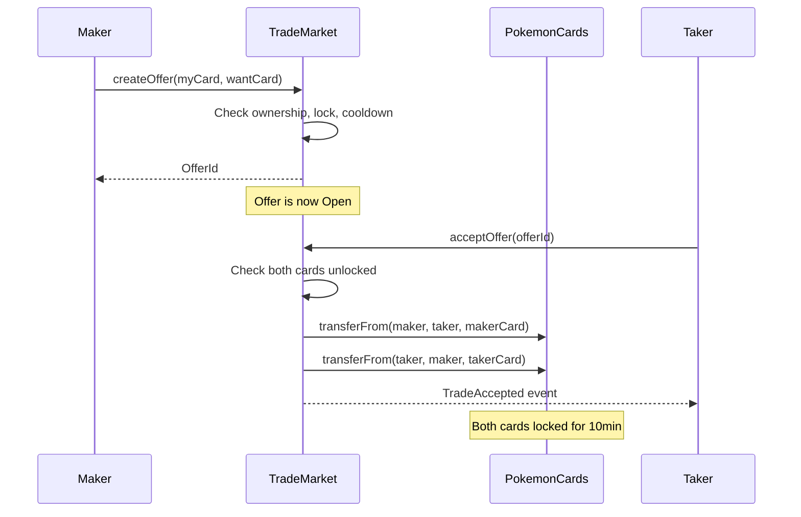

# Smart Contracts

5BLOCK uses two smart contracts: **PokemonCards** (NFT) and **TradeMarket** (marketplace).

---

## PokemonCards.sol

ERC-721 NFT contract for Pokemon trading cards.

### Constants

| Constant | Value | Description |
|----------|-------|-------------|
| `MAX_CARDS_PER_WALLET` | 4 | Maximum cards a wallet can own |
| `LOCK_DURATION` | 10 minutes | Lock period after acquisition |
| `MAX_POKEMON_ID` | 151 | Highest valid Pokemon ID (Gen 1) |
| `MIN_POKEMON_ID` | 1 | Lowest valid Pokemon ID |

### Key Functions

#### `mint(pokemonId, rarityTier, value, uri)`

Creates a new card NFT.

```solidity
function mint(
    uint256 pokemonId,
    uint8 rarityTier,
    uint256 value,
    string calldata uri
) external returns (uint256 tokenId)
```

- Validates pokemonId (1-151)
- Checks caller has < 4 cards
- Stores metadata on-chain
- Locks card for 10 minutes

#### `getCardMeta(tokenId)`

Returns on-chain metadata for a card.

```solidity
struct CardMeta {
    uint256 createdAt;
    uint256 lastTransferAt;
    uint256 lockUntil;
    uint256 pokemonId;
    uint8 rarityTier;
    uint256 value;
}
```

#### `getPreviousOwners(tokenId)`

Returns array of all previous owners (provenance).

#### `isLocked(tokenId)`

Returns `true` if card cannot be traded yet.

### Events

| Event | Emitted When |
|-------|--------------|
| `CardMinted` | New card created |
| `CardTransferred` | Card changes owner |
| `CardLocked` | Lock period starts/resets |

### Mint Flow



---

## TradeMarket.sol

Marketplace for peer-to-peer card trading.

### Constants

| Constant | Value | Description |
|----------|-------|-------------|
| `COOLDOWN_DURATION` | 5 minutes | Time between trade actions |

### Offer Structure

```solidity
struct Offer {
    address maker;
    uint256 makerTokenId;
    uint256 takerTokenId;
    OfferStatus status;  // Open, Cancelled, Accepted
    uint256 createdAt;
}
```

### Key Functions

#### `createOffer(makerTokenId, takerTokenId)`

Creates a trade offer.

- Maker must own `makerTokenId`
- `takerTokenId` must exist
- Card must not be locked
- Cooldown must have passed

#### `cancelOffer(offerId)`

Cancels an open offer (maker only).

#### `acceptOffer(offerId)`

Accepts an offer and executes the swap.

- Caller must own `takerTokenId`
- Both cards must not be locked
- Performs atomic swap via `transferFrom`

#### `getOpenOffers()`

Returns all offers with `Open` status.

### Events

| Event | Emitted When |
|-------|--------------|
| `TradeCreated` | New offer created |
| `TradeCancelled` | Offer cancelled |
| `TradeAccepted` | Trade executed |

### Trade Flow



---

## Security Features

### ReentrancyGuard

Both contracts inherit from OpenZeppelin's `ReentrancyGuard` to prevent reentrancy attacks.

### Ownership Validation

Every state-changing function validates the caller owns the relevant token.

### Lock Mechanism

10-minute lock after any transfer prevents:
- Rapid flipping
- Flash loan exploits
- Market manipulation

### Cooldown

5-minute cooldown between trade actions prevents:
- Spam attacks
- DoS via offer flooding

---

## Testing

Tests are located in:
- `test/PokemonCards.test.ts`
- `test/TradeMarket.test.ts`

Run tests:

```bash
pnpm test
```

Coverage target: **>80%**

Tests cover:
- Happy paths for all functions
- All revert conditions
- Edge cases (max cards, lock expiry, etc.)
