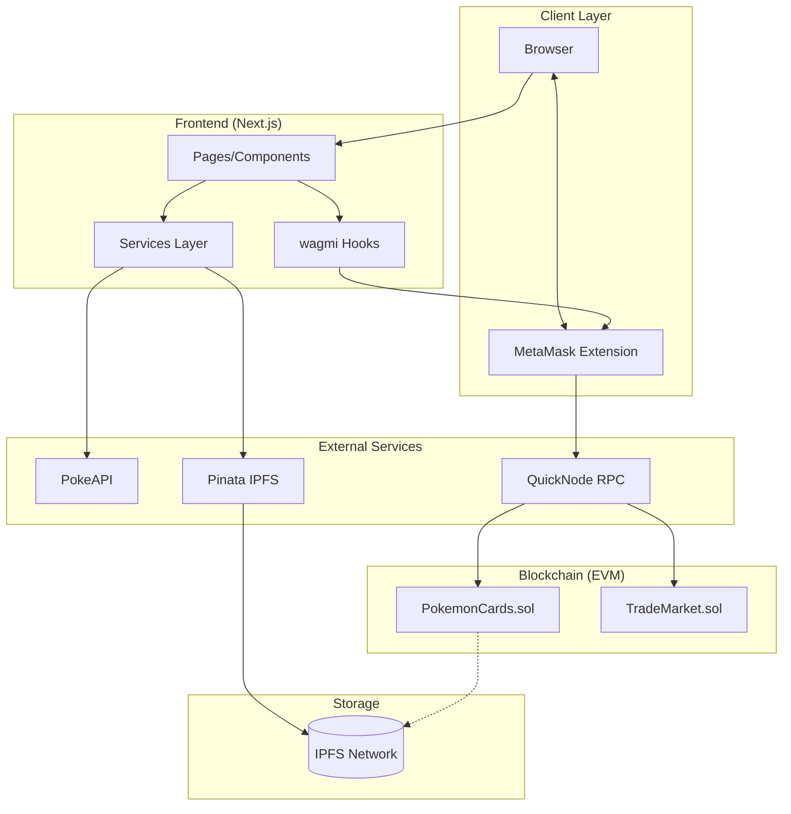

# Technology Stack — DApp Pokémon Cards Exchange

> Document de référence décrivant toutes les technologies utilisées dans le projet.

---

## Vue d'ensemble

```
┌─────────────────────────────────────────────────────────────────┐
│                         FRONTEND                                 │
│  Next.js 16.1.2 (App Router) + TypeScript + wagmi + viem            │
│  UI: shadcn/ui (Radix + Tailwind CSS)                           │
└─────────────────────────────────────────────────────────────────┘
                              │
                              ▼
┌─────────────────────────────────────────────────────────────────┐
│                      WALLET LAYER                                │
│  MetaMask (Browser Extension)                                    │
│  WalletConnect (Mobile alternative)                              │
└─────────────────────────────────────────────────────────────────┘
                              │
                              ▼
┌─────────────────────────────────────────────────────────────────┐
│                     BLOCKCHAIN LAYER                             │
│  Ethereum (Sepolia Testnet / Hardhat Local)                      │
│  Smart Contracts: Solidity 0.8.20 + OpenZeppelin                 │
└─────────────────────────────────────────────────────────────────┘
                              │
                              ▼
┌─────────────────────────────────────────────────────────────────┐
│                     STORAGE LAYER                                │
│  IPFS via Pinata (Images + Metadata JSON)                        │
└─────────────────────────────────────────────────────────────────┘
                              │
                              ▼
┌─────────────────────────────────────────────────────────────────┐
│                     EXTERNAL APIs                                │
│  PokeAPI (Pokémon data source)                                   │
│  QuickNode (Ethereum RPC provider)                               │
└─────────────────────────────────────────────────────────────────┘
```

---

## 1. Frontend

### 1.1 Next.js 14

| Aspect        | Choix                 | Justification                                    |
| ------------- | --------------------- | ------------------------------------------------ |
| **Version**   | 14.x (App Router)     | Dernière version stable, Server Components       |
| **Router**    | App Router            | Layouts, loading states, error boundaries natifs |
| **Rendering** | Client-side pour Web3 | wagmi/viem nécessitent le browser                |

**Configuration clé :**

```javascript
// next.config.js
module.exports = {
  reactStrictMode: true,
  images: {
    remotePatterns: [
      { protocol: "https", hostname: "raw.githubusercontent.com" }, // PokeAPI sprites
      { protocol: "https", hostname: "gateway.pinata.cloud" }, // IPFS
    ],
  },
  webpack: (config) => {
    config.resolve.fallback = { fs: false, net: false, tls: false };
    return config;
  },
};
```

### 1.2 TypeScript

| Aspect          | Configuration |
| --------------- | ------------- |
| **Version**     | 5.x           |
| **Strict mode** | `true`        |
| **Target**      | ES2022        |

**Avantages pour le projet :**

- Typage des ABIs contrats (via wagmi CLI)
- Autocomplétion des méthodes contrat
- Détection erreurs à la compilation

### 1.3 wagmi + viem

| Package                   | Version | Rôle                                        |
| ------------------------- | ------- | ------------------------------------------- |
| **wagmi**                 | 2.x     | React hooks pour Ethereum                   |
| **viem**                  | 2.x     | Client Ethereum TypeScript-first            |
| **@tanstack/react-query** | 5.x     | Cache & state management (requis par wagmi) |

**Pourquoi wagmi/viem vs ethers.js :**

- TypeScript-first (meilleur DX)
- Hooks React natifs
- Bundle size plus petit
- Meilleure gestion des erreurs

**Hooks wagmi utilisés :**

```typescript
// Connexion
useAccount(); // État du wallet connecté
useConnect(); // Connexion wallet
useDisconnect(); // Déconnexion

// Lecture contrat
useReadContract(); // Lecture single
useReadContracts(); // Lecture batch

// Écriture contrat
useWriteContract(); // Transaction
useWaitForTransactionReceipt(); // Attente confirmation

// Events
useWatchContractEvent(); // Écoute events en temps réel

// Réseau
useChainId(); // Chain ID actuel
useSwitchChain(); // Changement de réseau
```

### 1.4 UI Components (shadcn/ui)

| Aspect      | Choix                           |
| ----------- | ------------------------------- |
| **Base**    | Radix UI (accessible, unstyled) |
| **Styling** | Tailwind CSS                    |
| **Theming** | CSS variables                   |

**Composants utilisés :**

- `Button`, `Card`, `Dialog`, `Sheet`
- `Table`, `Tabs`, `Badge`
- `Toast` (notifications)
- `Skeleton` (loading states)

**Installation :**

```bash
npx shadcn-ui@latest init
npx shadcn-ui@latest add button card dialog table toast
```

---

## 2. Blockchain

### 2.1 Solidity

| Aspect        | Choix             |
| ------------- | ----------------- |
| **Version**   | 0.8.20            |
| **Optimizer** | Enabled, 200 runs |
| **License**   | MIT               |

**Pourquoi 0.8.20 :**

- Checked arithmetic natif (pas de SafeMath)
- Custom errors (gas efficient)
- Support PUSH0 opcode

### 2.2 OpenZeppelin Contracts

| Contrat              | Version | Usage                      |
| -------------------- | ------- | -------------------------- |
| **ERC721**           | 5.x     | Base token non-fongible    |
| **ERC721URIStorage** | 5.x     | Stockage tokenURI on-chain |
| **Ownable**          | 5.x     | Contrôle admin             |
| **ReentrancyGuard**  | 5.x     | Protection reentrancy      |

**Installation :**

```bash
npm install @openzeppelin/contracts
```

### 2.3 Hardhat

| Aspect       | Configuration           |
| ------------ | ----------------------- |
| **Version**  | 2.x                     |
| **Network**  | Hardhat local + Sepolia |
| **Testing**  | Chai + Mocha            |
| **Coverage** | solidity-coverage       |

**Plugins utilisés :**

```javascript
// hardhat.config.ts
import "@nomicfoundation/hardhat-toolbox";
import "@nomicfoundation/hardhat-verify";

const config: HardhatUserConfig = {
  solidity: {
    version: "0.8.20",
    settings: {
      optimizer: { enabled: true, runs: 200 },
    },
  },
  networks: {
    hardhat: {
      chainId: 31337,
    },
    sepolia: {
      url: process.env.QUICKNODE_URL,
      accounts: [process.env.PRIVATE_KEY],
    },
  },
};
```

**Scripts Hardhat :**

```bash
npx hardhat compile          # Compilation
npx hardhat test             # Tests
npx hardhat coverage         # Couverture
npx hardhat node             # Node local
npx hardhat run scripts/deploy.ts --network sepolia  # Déploiement
```

---

## 3. Storage (IPFS)

### 3.1 Pinata

| Aspect               | Détail                  |
| -------------------- | ----------------------- |
| **Service**          | Pinata Cloud (freemium) |
| **API**              | REST + SDK              |
| **Limite free tier** | 500 pins, 1GB storage   |

**Endpoints utilisés :**

```
POST https://api.pinata.cloud/pinning/pinFileToIPFS    # Pin image
POST https://api.pinata.cloud/pinning/pinJSONToIPFS    # Pin metadata
GET  https://gateway.pinata.cloud/ipfs/{CID}           # Fetch via gateway
```

**SDK Pinata :**

```typescript
import { PinataSDK } from "pinata";

const pinata = new PinataSDK({
  pinataJwt: process.env.PINATA_JWT,
  pinataGateway: "gateway.pinata.cloud",
});

// Pin file
const { IpfsHash } = await pinata.upload.file(file);

// Pin JSON
const { IpfsHash } = await pinata.upload.json(metadata);
```

### 3.2 IPFS Gateways (fallback)

| Gateway    | URL                    | Usage      |
| ---------- | ---------------------- | ---------- |
| Pinata     | `gateway.pinata.cloud` | Primary    |
| IPFS.io    | `ipfs.io`              | Fallback 1 |
| Cloudflare | `cloudflare-ipfs.com`  | Fallback 2 |

---

## 4. External APIs

### 4.1 PokeAPI

| Aspect         | Détail                        |
| -------------- | ----------------------------- |
| **Base URL**   | `https://pokeapi.co/api/v2`   |
| **Rate limit** | 100 req/minute (no auth)      |
| **Cache**      | Réponses cachées côté serveur |

**Endpoints utilisés :**

```
GET /pokemon/{id}              # Détails d'un Pokémon
GET /pokemon?limit=151         # Liste Gen 1
GET /pokemon-species/{id}      # Infos espèce (description)
```

**Données extraites :**

```typescript
interface PokeAPIResponse {
  id: number;
  name: string;
  types: Array<{ type: { name: string } }>;
  stats: Array<{ base_stat: number; stat: { name: string } }>;
  sprites: {
    front_default: string;
    other: {
      "official-artwork": { front_default: string };
    };
  };
  base_experience: number;
  height: number;
  weight: number;
}
```

### 4.2 QuickNode (RPC Provider)

| Aspect        | Détail                    |
| ------------- | ------------------------- |
| **Réseaux**   | Ethereum Mainnet, Sepolia |
| **Endpoints** | HTTP + WebSocket          |
| **Free tier** | 10M requests/month        |

**Configuration wagmi :**

```typescript
import { http } from "wagmi";
import { sepolia, hardhat } from "wagmi/chains";

const config = createConfig({
  chains: [sepolia, hardhat],
  transports: {
    [sepolia.id]: http(process.env.NEXT_PUBLIC_QUICKNODE_URL),
    [hardhat.id]: http("http://127.0.0.1:8545"),
  },
});
```

---

## 5. Wallet

### 5.1 MetaMask

| Aspect        | Détail             |
| ------------- | ------------------ |
| **Type**      | Browser Extension  |
| **Connector** | wagmi `injected()` |
| **Networks**  | Auto-detection     |

**Configuration wagmi :**

```typescript
import { injected } from "wagmi/connectors";

const config = createConfig({
  connectors: [injected({ target: "metaMask" })],
});
```

### 5.2 WalletConnect (optionnel)

| Aspect         | Détail                           |
| -------------- | -------------------------------- |
| **Type**       | QR Code / Deep link              |
| **Usage**      | Mobile wallets                   |
| **Project ID** | Requis (cloud.walletconnect.com) |

---

## 6. Development Tools

### 6.1 Package Manager

| Tool     | Version | Usage                             |
| -------- | ------- | --------------------------------- |
| **pnpm** | 8.x     | Recommandé (fast, disk efficient) |
| **npm**  | 10.x    | Alternative                       |

### 6.2 Linting & Formatting

| Tool         | Config                                |
| ------------ | ------------------------------------- |
| **ESLint**   | `next/core-web-vitals` + custom rules |
| **Prettier** | Standard config                       |
| **Solhint**  | Solidity linting                      |

### 6.3 Git Hooks

```bash
# .husky/pre-commit
npm run lint
npm run test
```

---

## 7. Environment Variables

### 7.1 Frontend (.env.local)

```env
# Pinata
NEXT_PUBLIC_PINATA_GATEWAY=gateway.pinata.cloud
PINATA_JWT=your_jwt_token

# Blockchain
NEXT_PUBLIC_QUICKNODE_URL=https://your-endpoint.quiknode.pro/
NEXT_PUBLIC_CHAIN_ID=11155111

# Contracts (après déploiement)
NEXT_PUBLIC_POKEMON_CARDS_ADDRESS=0x...
NEXT_PUBLIC_TRADE_MARKET_ADDRESS=0x...
```

### 7.2 Hardhat (.env)

```env
# RPC
QUICKNODE_URL=https://your-endpoint.quiknode.pro/

# Deployment
PRIVATE_KEY=0x...

# Verification
ETHERSCAN_API_KEY=your_api_key
```

---

## 8. Versions Summary

| Package      | Version | Lock  |
| ------------ | ------- | ----- |
| Next.js      | ^14.0.0 | ~14.x |
| React        | ^18.2.0 | ~18.x |
| TypeScript   | ^5.3.0  | ~5.x  |
| wagmi        | ^2.5.0  | ~2.x  |
| viem         | ^2.7.0  | ~2.x  |
| Solidity     | 0.8.20  | Exact |
| OpenZeppelin | ^5.0.0  | ~5.x  |
| Hardhat      | ^2.19.0 | ~2.x  |
| Tailwind CSS | ^3.4.0  | ~3.x  |

---

## 9. Architecture Diagram


