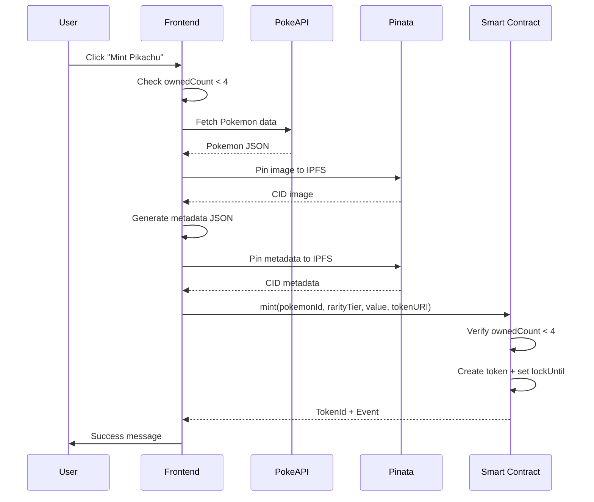
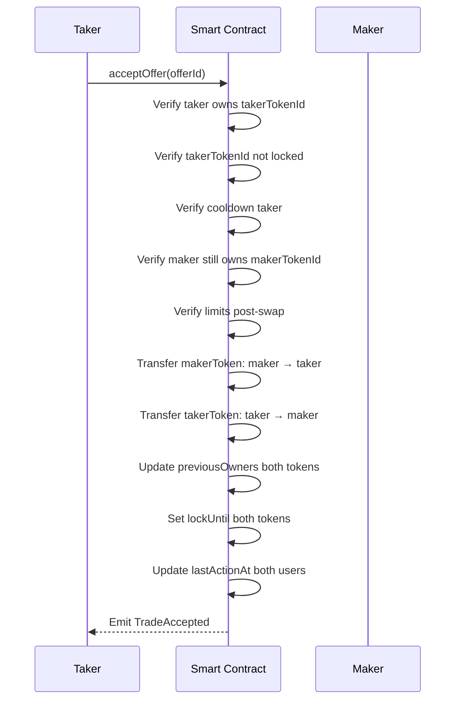

# User Stories & Spécifications — DApp Pokémon Cards Exchange

> Document BMAD : User Stories détaillées avec critères d'acceptation, spécifications techniques et scénarios de test.

---

## Table des matières

1. [Epic 1: Gestion du Wallet](#epic-1-gestion-du-wallet)
2. [Epic 2: Gestion des Cartes (Tokens)](#epic-2-gestion-des-cartes-tokens)
3. [Epic 3: Marketplace d'Échange](#epic-3-marketplace-déchange)
4. [Epic 4: Contraintes Temporelles](#epic-4-contraintes-temporelles)
5. [Epic 5: IPFS & Métadonnées](#epic-5-ipfs--métadonnées)
6. [Epic 6: Historique & Traçabilité](#epic-6-historique--traçabilité)
7. [Spécifications Techniques Détaillées](#spécifications-techniques-détaillées)
8. [Matrice de Traçabilité](#matrice-de-traçabilité)

---

## Epic 1: Gestion du Wallet

### US-1.1: Connexion Wallet

**En tant qu'** utilisateur,
**Je veux** connecter mon wallet MetaMask à la DApp,
**Afin de** pouvoir interagir avec mes cartes et le marketplace.

#### Critères d'acceptation

- [ ] AC-1.1.1: Un bouton "Connect Wallet" est visible sur la page d'accueil
- [ ] AC-1.1.2: Au clic, MetaMask s'ouvre et demande l'autorisation de connexion
- [ ] AC-1.1.3: Après connexion, l'adresse du wallet est affichée (format tronqué: `0x1234...abcd`)
- [ ] AC-1.1.4: L'état de connexion persiste lors de la navigation entre pages
- [ ] AC-1.1.5: Si MetaMask n'est pas installé, un message d'erreur guide l'utilisateur

#### Spécifications techniques

```typescript
// Hook wagmi attendu
const { address, isConnected, connect, disconnect } = useAccount()
const { connectors } = useConnect()

// État UI
interface WalletState {
  address: `0x${string}` | undefined
  isConnected: boolean
  chainId: number | undefined
}
```

#### Scénarios de test

| ID | Scénario | Résultat attendu |
|----|----------|------------------|
| T-1.1.1 | Utilisateur clique "Connect" avec MetaMask installé | Popup MetaMask s'ouvre |
| T-1.1.2 | Utilisateur approuve la connexion | Adresse affichée, bouton devient "Disconnect" |
| T-1.1.3 | Utilisateur refuse la connexion | Message d'erreur, bouton reste "Connect" |
| T-1.1.4 | MetaMask non installé | Lien vers installation MetaMask |

---

### US-1.2: Déconnexion Wallet

**En tant qu'** utilisateur connecté,
**Je veux** pouvoir déconnecter mon wallet,
**Afin de** sécuriser ma session ou changer de compte.

#### Critères d'acceptation

- [ ] AC-1.2.1: Un bouton "Disconnect" est visible quand connecté
- [ ] AC-1.2.2: Au clic, la session est terminée
- [ ] AC-1.2.3: L'utilisateur est redirigé vers l'état non-connecté
- [ ] AC-1.2.4: Les données en cache sont nettoyées

---

### US-1.3: Détection du réseau

**En tant qu'** utilisateur,
**Je veux** être averti si je suis sur le mauvais réseau,
**Afin de** éviter des erreurs de transaction.

#### Critères d'acceptation

- [ ] AC-1.3.1: Le réseau actuel est affiché (ex: "Sepolia", "Localhost")
- [ ] AC-1.3.2: Si mauvais réseau, un warning s'affiche avec bouton "Switch Network"
- [ ] AC-1.3.3: Le switch network déclenche la demande MetaMask

#### Réseaux supportés

| Réseau | Chain ID | Usage |
|--------|----------|-------|
| Hardhat Local | 31337 | Développement |
| Sepolia | 11155111 | Testnet |

---

## Epic 2: Gestion des Cartes (Tokens)

### US-2.1: Consulter le catalogue Pokémon

**En tant qu'** utilisateur,
**Je veux** voir la liste des Pokémon disponibles à minter,
**Afin de** choisir quelle carte je souhaite obtenir.

#### Critères d'acceptation

- [ ] AC-2.1.1: La page `/catalog` affiche les Pokémon #1 à #151
- [ ] AC-2.1.2: Chaque Pokémon affiche: image, nom, type(s), stats de base
- [ ] AC-2.1.3: Un indicateur de rareté est calculé et affiché
- [ ] AC-2.1.4: Les données proviennent de PokeAPI
- [ ] AC-2.1.5: Un loader s'affiche pendant le chargement
- [ ] AC-2.1.6: Pagination ou scroll infini pour gérer les 151 entrées

#### Spécifications techniques

```typescript
// Modèle de données Pokémon (depuis PokeAPI)
interface PokemonTemplate {
  id: number                    // 1-151
  name: string                  // "pikachu"
  types: string[]               // ["electric"]
  stats: {
    hp: number
    attack: number
    defense: number
    speed: number
  }
  sprites: {
    front_default: string       // URL image
    official_artwork: string    // URL HD
  }
  base_experience: number       // Pour calcul rareté
}

// Calcul de rareté
function calculateRarity(pokemon: PokemonTemplate): RarityTier {
  const score = pokemon.stats.hp + pokemon.stats.attack + pokemon.stats.defense
  if (score >= 250) return 'LEGENDARY'  // Tier 4
  if (score >= 200) return 'RARE'       // Tier 3
  if (score >= 150) return 'UNCOMMON'   // Tier 2
  return 'COMMON'                        // Tier 1
}

// Calcul de valeur
function calculateValue(pokemon: PokemonTemplate): number {
  return pokemon.stats.hp + pokemon.stats.attack + pokemon.stats.defense
}
```

#### API PokeAPI

```
GET https://pokeapi.co/api/v2/pokemon/{id}
GET https://pokeapi.co/api/v2/pokemon?limit=151
```

---

### US-2.2: Minter une carte Pokémon

**En tant qu'** utilisateur connecté,
**Je veux** minter une carte Pokémon depuis le catalogue,
**Afin de** l'ajouter à ma collection.

#### Critères d'acceptation

- [ ] AC-2.2.1: Bouton "Mint" visible sur chaque carte du catalogue
- [ ] AC-2.2.2: Le mint est bloqué si l'utilisateur possède déjà 4 cartes
- [ ] AC-2.2.3: Avant mint, l'image et metadata sont pinnés sur IPFS
- [ ] AC-2.2.4: La transaction est signée via MetaMask
- [ ] AC-2.2.5: Après succès, la carte apparaît dans l'inventaire
- [ ] AC-2.2.6: La carte est verrouillée 10 minutes après mint
- [ ] AC-2.2.7: Un message de succès/erreur est affiché

#### Flow de mint



#### Spécifications Smart Contract

```solidity
function mint(
    uint256 pokemonId,
    uint8 rarityTier,
    uint256 value,
    string calldata tokenURI
) external returns (uint256 tokenId);

// Reverts
// - "MaxCardsReached": ownedCount[msg.sender] >= 4
// - "InvalidPokemonId": pokemonId < 1 || pokemonId > 151
```

#### Scénarios de test

| ID | Scénario | Résultat attendu |
|----|----------|------------------|
| T-2.2.1 | Mint avec 0 carte possédée | Succès, ownedCount = 1 |
| T-2.2.2 | Mint avec 3 cartes possédées | Succès, ownedCount = 4 |
| T-2.2.3 | Mint avec 4 cartes possédées | Revert "MaxCardsReached" |
| T-2.2.4 | Mint avec pokemonId = 0 | Revert "InvalidPokemonId" |
| T-2.2.5 | Mint avec pokemonId = 152 | Revert "InvalidPokemonId" |

---

### US-2.3: Consulter mon inventaire

**En tant qu'** utilisateur connecté,
**Je veux** voir toutes mes cartes Pokémon,
**Afin de** gérer ma collection et initier des échanges.

#### Critères d'acceptation

- [ ] AC-2.3.1: La page `/inventory` liste toutes les cartes du wallet connecté
- [ ] AC-2.3.2: Chaque carte affiche: image, nom, type, rareté, valeur
- [ ] AC-2.3.3: L'état de lock est visible (icône cadenas + temps restant)
- [ ] AC-2.3.4: Le nombre total de cartes est affiché (ex: "3/4 cartes")
- [ ] AC-2.3.5: Un message s'affiche si l'inventaire est vide
- [ ] AC-2.3.6: Les metadata sont chargées depuis IPFS via tokenURI

#### Spécifications techniques

```typescript
// Lecture des tokens du wallet
interface OwnedCard {
  tokenId: bigint
  pokemonId: number
  rarityTier: RarityTier
  value: number
  tokenURI: string
  createdAt: number
  lastTransferAt: number
  lockUntil: number
  isLocked: boolean          // computed: lockUntil > now
  metadata: CardMetadata     // fetched from IPFS
}

// Appel contrat
function getCardsByOwner(owner: address): uint256[]
function getCardMeta(tokenId: uint256): CardMeta
```

---

### US-2.4: Voir les détails d'une carte

**En tant qu'** utilisateur,
**Je veux** voir les détails complets d'une carte,
**Afin de** connaître son historique et ses caractéristiques.

#### Critères d'acceptation

- [ ] AC-2.4.1: Click sur une carte ouvre une modale/page de détails
- [ ] AC-2.4.2: Affiche: image HD, stats complètes, historique des propriétaires
- [ ] AC-2.4.3: Timestamps affichés en format lisible
- [ ] AC-2.4.4: Lien vers la metadata IPFS (CID)
- [ ] AC-2.4.5: Bouton "Proposer échange" si carte non verrouillée et appartient à l'utilisateur

#### Données affichées

| Champ | Source | Format |
|-------|--------|--------|
| Image | IPFS | PNG/SVG |
| Nom | Metadata | "Pikachu #25" |
| Type | Metadata | Badge coloré |
| Rareté | On-chain | Tier + couleur |
| Valeur | On-chain | Nombre |
| Créé le | On-chain | Date/heure |
| Dernier transfert | On-chain | Date/heure |
| Verrouillé jusqu'à | On-chain | Date/heure ou "Disponible" |
| Propriétaires précédents | On-chain | Liste d'adresses |

---

## Epic 3: Marketplace d'Échange

### US-3.1: Créer une offre d'échange

**En tant qu'** utilisateur connecté possédant au moins une carte,
**Je veux** créer une offre d'échange,
**Afin de** proposer un swap avec d'autres utilisateurs.

#### Critères d'acceptation

- [ ] AC-3.1.1: Page `/trade` avec formulaire de création d'offre
- [ ] AC-3.1.2: Sélection de ma carte à échanger (dropdown/grid)
- [ ] AC-3.1.3: Sélection de la carte souhaitée (par tokenId ou recherche)
- [ ] AC-3.1.4: Validation: ma carte ne doit pas être verrouillée
- [ ] AC-3.1.5: Validation: cooldown de 5 min respecté
- [ ] AC-3.1.6: Transaction signée via MetaMask
- [ ] AC-3.1.7: Offre apparaît dans la liste des offres ouvertes
- [ ] AC-3.1.8: Event `TradeCreated` émis

#### Spécifications Smart Contract

```solidity
function createOffer(
    uint256 makerTokenId,
    uint256 takerTokenId
) external returns (uint256 offerId);

// Checks
// - msg.sender owns makerTokenId
// - makerTokenId not locked
// - cooldown respected (lastActionAt + 5 min)
// - takerTokenId exists

// Effects
// - Create Offer struct
// - Update lastActionAt[msg.sender]
// - Emit TradeCreated(offerId, maker, makerTokenId, takerTokenId)
```

#### Scénarios de test

| ID | Scénario | Résultat attendu |
|----|----------|------------------|
| T-3.1.1 | Créer offre avec carte non verrouillée | Succès |
| T-3.1.2 | Créer offre avec carte verrouillée | Revert "CardLocked" |
| T-3.1.3 | Créer offre puis nouvelle offre immédiatement | Revert "CooldownActive" |
| T-3.1.4 | Créer offre après 5 min | Succès |
| T-3.1.5 | Créer offre pour carte inexistante | Revert "TokenNotFound" |

---

### US-3.2: Consulter les offres d'échange

**En tant qu'** utilisateur,
**Je veux** voir toutes les offres d'échange ouvertes,
**Afin de** trouver un échange intéressant.

#### Critères d'acceptation

- [ ] AC-3.2.1: Liste des offres avec statut "Open"
- [ ] AC-3.2.2: Chaque offre affiche: carte proposée, carte demandée, maker
- [ ] AC-3.2.3: Filtrage possible par: type de carte, rareté
- [ ] AC-3.2.4: Indicateur si je possède la carte demandée
- [ ] AC-3.2.5: Bouton "Accepter" visible si je peux accepter l'offre

#### Spécifications techniques

```typescript
interface TradeOffer {
  offerId: bigint
  maker: `0x${string}`
  makerTokenId: bigint
  makerCard: OwnedCard        // metadata enrichie
  takerTokenId: bigint
  takerCard: OwnedCard        // metadata enrichie
  status: 'Open' | 'Cancelled' | 'Accepted'
  createdAt: number
  canAccept: boolean          // computed: je possède takerCard + pas locked + cooldown ok
}

// Lecture
function getOpenOffers(): Offer[]
function getOfferById(offerId: uint256): Offer
```

---

### US-3.3: Accepter une offre d'échange

**En tant qu'** utilisateur possédant la carte demandée,
**Je veux** accepter une offre d'échange,
**Afin de** réaliser le swap atomiquement.

#### Critères d'acceptation

- [ ] AC-3.3.1: Bouton "Accepter" sur une offre où je possède la carte demandée
- [ ] AC-3.3.2: Validation: ma carte n'est pas verrouillée
- [ ] AC-3.3.3: Validation: cooldown de 5 min respecté
- [ ] AC-3.3.4: Validation: limite de 4 cartes respectée (post-échange)
- [ ] AC-3.3.5: Transaction signée via MetaMask
- [ ] AC-3.3.6: Swap atomique: les 2 cartes changent de propriétaire
- [ ] AC-3.3.7: Les 2 cartes sont verrouillées 10 min après échange
- [ ] AC-3.3.8: Event `TradeAccepted` émis
- [ ] AC-3.3.9: previousOwners mis à jour pour les 2 cartes

#### Flow d'acceptation



#### Spécifications Smart Contract

```solidity
function acceptOffer(uint256 offerId) external;

// Checks
// - offer.status == Open
// - msg.sender owns offer.takerTokenId
// - offer.takerTokenId not locked
// - offer.makerTokenId not locked (maker might have traded it)
// - cooldown msg.sender respected
// - ownedCount[msg.sender] won't exceed 4 after swap
// - ownedCount[maker] won't exceed 4 after swap

// Effects
// - Transfer tokens
// - Update previousOwners
// - Set lockUntil = now + 10 min for both
// - Update lastActionAt for both users
// - offer.status = Accepted
// - Emit TradeAccepted(offerId, taker)
```

#### Scénarios de test

| ID | Scénario | Résultat attendu |
|----|----------|------------------|
| T-3.3.1 | Accepter offre valide | Succès, tokens échangés |
| T-3.3.2 | Accepter avec carte verrouillée | Revert "CardLocked" |
| T-3.3.3 | Accepter immédiatement après autre action | Revert "CooldownActive" |
| T-3.3.4 | Accepter offre déjà acceptée | Revert "OfferNotOpen" |
| T-3.3.5 | Accepter sans posséder la carte demandée | Revert "NotOwner" |
| T-3.3.6 | Accepter quand maker n'a plus la carte | Revert "MakerNotOwner" |
| T-3.3.7 | Vérifier lock 10 min après échange | Les 2 cartes sont locked |
| T-3.3.8 | Vérifier previousOwners après échange | Anciens owners ajoutés |

---

### US-3.4: Annuler une offre d'échange

**En tant que** créateur d'une offre,
**Je veux** pouvoir annuler mon offre,
**Afin de** retirer ma carte du marketplace si je change d'avis.

#### Critères d'acceptation

- [ ] AC-3.4.1: Bouton "Annuler" visible sur mes offres ouvertes
- [ ] AC-3.4.2: Validation: seul le maker peut annuler
- [ ] AC-3.4.3: Validation: cooldown de 5 min respecté
- [ ] AC-3.4.4: Offre passe en statut "Cancelled"
- [ ] AC-3.4.5: Event `TradeCancelled` émis

#### Spécifications Smart Contract

```solidity
function cancelOffer(uint256 offerId) external;

// Checks
// - msg.sender == offer.maker
// - offer.status == Open
// - cooldown respected

// Effects
// - offer.status = Cancelled
// - Update lastActionAt[msg.sender]
// - Emit TradeCancelled(offerId)
```

---

### US-3.5: Voir mes offres

**En tant qu'** utilisateur connecté,
**Je veux** voir toutes mes offres (créées et reçues),
**Afin de** suivre l'état de mes échanges.

#### Critères d'acceptation

- [ ] AC-3.5.1: Section "Mes offres créées" avec statut
- [ ] AC-3.5.2: Section "Offres où je suis taker potentiel"
- [ ] AC-3.5.3: Filtrage par statut (Open/Cancelled/Accepted)
- [ ] AC-3.5.4: Actions contextuelles (Annuler si créateur, Accepter si taker)

---

## Epic 4: Contraintes Temporelles

### US-4.1: Respecter le cooldown wallet

**En tant que** système,
**Je dois** empêcher un utilisateur d'effectuer plusieurs actions d'échange en moins de 5 minutes,
**Afin de** limiter le spam et favoriser des échanges réfléchis.

#### Critères d'acceptation

- [ ] AC-4.1.1: Après createOffer, 5 min avant nouvelle action
- [ ] AC-4.1.2: Après acceptOffer, 5 min avant nouvelle action
- [ ] AC-4.1.3: Après cancelOffer, 5 min avant nouvelle action
- [ ] AC-4.1.4: Le mint n'est PAS soumis au cooldown
- [ ] AC-4.1.5: UI affiche le temps restant avant prochaine action

#### Spécifications techniques

```solidity
uint256 public constant COOLDOWN_DURATION = 5 minutes;
mapping(address => uint256) public lastActionAt;

modifier checkCooldown() {
    require(
        block.timestamp >= lastActionAt[msg.sender] + COOLDOWN_DURATION,
        "CooldownActive"
    );
    _;
    lastActionAt[msg.sender] = block.timestamp;
}
```

#### Scénarios de test Hardhat

```typescript
describe("Cooldown", () => {
  it("should revert if action within 5 minutes", async () => {
    await tradeMarket.createOffer(tokenId1, tokenId2);
    await expect(
      tradeMarket.createOffer(tokenId3, tokenId4)
    ).to.be.revertedWith("CooldownActive");
  });

  it("should allow action after 5 minutes", async () => {
    await tradeMarket.createOffer(tokenId1, tokenId2);
    await time.increase(5 * 60); // 5 minutes
    await expect(
      tradeMarket.createOffer(tokenId3, tokenId4)
    ).to.not.be.reverted;
  });
});
```

---

### US-4.2: Respecter le lock carte

**En tant que** système,
**Je dois** empêcher l'échange d'une carte pendant 10 minutes après son acquisition,
**Afin de** stabiliser les échanges et éviter le "flipping" rapide.

#### Critères d'acceptation

- [ ] AC-4.2.1: Après mint, la carte est verrouillée 10 min
- [ ] AC-4.2.2: Après réception via échange, la carte est verrouillée 10 min
- [ ] AC-4.2.3: Une carte verrouillée ne peut pas être proposée en échange
- [ ] AC-4.2.4: Une carte verrouillée ne peut pas être utilisée pour accepter un échange
- [ ] AC-4.2.5: UI affiche l'icône de lock et le temps restant

#### Spécifications techniques

```solidity
uint256 public constant LOCK_DURATION = 10 minutes;

// Dans CardMeta
uint256 lockUntil;

// Lors du mint
cardMeta.lockUntil = block.timestamp + LOCK_DURATION;

// Lors du transfert (échange)
cardMeta.lockUntil = block.timestamp + LOCK_DURATION;

modifier checkNotLocked(uint256 tokenId) {
    require(
        block.timestamp >= cards[tokenId].lockUntil,
        "CardLocked"
    );
    _;
}
```

#### Scénarios de test Hardhat

```typescript
describe("Lock", () => {
  it("should lock card for 10 minutes after mint", async () => {
    const tokenId = await pokemonCards.mint(...);
    await expect(
      tradeMarket.createOffer(tokenId, otherTokenId)
    ).to.be.revertedWith("CardLocked");
  });

  it("should unlock card after 10 minutes", async () => {
    const tokenId = await pokemonCards.mint(...);
    await time.increase(10 * 60); // 10 minutes
    await expect(
      tradeMarket.createOffer(tokenId, otherTokenId)
    ).to.not.be.reverted;
  });

  it("should lock both cards after trade", async () => {
    await tradeMarket.acceptOffer(offerId);
    // Both cards should be locked
    await expect(
      tradeMarket.connect(maker).createOffer(takerTokenId, ...)
    ).to.be.revertedWith("CardLocked");
  });
});
```

---

## Epic 5: IPFS & Métadonnées

### US-5.1: Stocker les images sur IPFS

**En tant que** système,
**Je dois** pinner les images Pokémon sur IPFS via Pinata,
**Afin de** garantir leur disponibilité décentralisée.

#### Critères d'acceptation

- [ ] AC-5.1.1: Image téléchargée depuis PokeAPI
- [ ] AC-5.1.2: Image pinnée sur Pinata
- [ ] AC-5.1.3: CID retourné et stocké dans metadata

#### Flow technique

```typescript
async function pinImage(pokemonId: number): Promise<string> {
  // 1. Fetch image from PokeAPI
  const pokemon = await fetch(`https://pokeapi.co/api/v2/pokemon/${pokemonId}`);
  const data = await pokemon.json();
  const imageUrl = data.sprites.other['official-artwork'].front_default;

  // 2. Download image
  const imageResponse = await fetch(imageUrl);
  const imageBuffer = await imageResponse.arrayBuffer();

  // 3. Pin to Pinata
  const formData = new FormData();
  formData.append('file', new Blob([imageBuffer]), `pokemon-${pokemonId}.png`);

  const pinataResponse = await fetch('https://api.pinata.cloud/pinning/pinFileToIPFS', {
    method: 'POST',
    headers: { 'Authorization': `Bearer ${PINATA_JWT}` },
    body: formData
  });

  const { IpfsHash } = await pinataResponse.json();
  return `ipfs://${IpfsHash}`;
}
```

---

### US-5.2: Stocker les métadonnées sur IPFS

**En tant que** système,
**Je dois** générer et pinner les métadonnées JSON sur IPFS,
**Afin de** respecter le standard NFT metadata.

#### Critères d'acceptation

- [ ] AC-5.2.1: JSON généré au format spécifié
- [ ] AC-5.2.2: JSON pinné sur Pinata
- [ ] AC-5.2.3: tokenURI pointe vers le CID

#### Format metadata

```json
{
  "name": "Pikachu #25",
  "description": "A Pokémon trading card",
  "image": "ipfs://QmImageCID",
  "external_url": "https://pokeapi.co/api/v2/pokemon/25",
  "attributes": [
    { "trait_type": "Type", "value": "Electric" },
    { "trait_type": "HP", "value": 35 },
    { "trait_type": "Attack", "value": 55 },
    { "trait_type": "Defense", "value": 40 },
    { "trait_type": "Rarity", "value": "Rare" },
    { "trait_type": "Value", "value": 130 }
  ],
  "properties": {
    "pokemonId": 25,
    "rarityTier": 3,
    "value": 130,
    "createdAt": 1700000000,
    "lastTransferAt": 1700000000,
    "previousOwners": []
  }
}
```

#### Flow technique

```typescript
async function pinMetadata(
  pokemon: PokemonTemplate,
  imageCID: string,
  owner: string
): Promise<string> {
  const metadata: CardMetadata = {
    name: `${pokemon.name} #${pokemon.id}`,
    description: "A Pokémon trading card",
    image: imageCID,
    external_url: `https://pokeapi.co/api/v2/pokemon/${pokemon.id}`,
    attributes: [
      { trait_type: "Type", value: pokemon.types[0] },
      { trait_type: "HP", value: pokemon.stats.hp },
      { trait_type: "Attack", value: pokemon.stats.attack },
      { trait_type: "Defense", value: pokemon.stats.defense },
      { trait_type: "Rarity", value: calculateRarity(pokemon) },
      { trait_type: "Value", value: calculateValue(pokemon) }
    ],
    properties: {
      pokemonId: pokemon.id,
      rarityTier: getRarityTierNumber(calculateRarity(pokemon)),
      value: calculateValue(pokemon),
      createdAt: Math.floor(Date.now() / 1000),
      lastTransferAt: Math.floor(Date.now() / 1000),
      previousOwners: []
    }
  };

  const pinataResponse = await fetch('https://api.pinata.cloud/pinning/pinJSONToIPFS', {
    method: 'POST',
    headers: {
      'Authorization': `Bearer ${PINATA_JWT}`,
      'Content-Type': 'application/json'
    },
    body: JSON.stringify(metadata)
  });

  const { IpfsHash } = await pinataResponse.json();
  return `ipfs://${IpfsHash}`;
}
```

---

### US-5.3: Lire les métadonnées depuis IPFS

**En tant qu'** utilisateur,
**Je veux** que l'UI charge les métadonnées depuis IPFS,
**Afin de** voir les informations complètes de mes cartes.

#### Critères d'acceptation

- [ ] AC-5.3.1: tokenURI lu depuis le contrat
- [ ] AC-5.3.2: Métadonnées fetchées via gateway IPFS
- [ ] AC-5.3.3: Cache local pour éviter requêtes répétées
- [ ] AC-5.3.4: Fallback si IPFS indisponible

#### Gateway IPFS

```typescript
const IPFS_GATEWAYS = [
  'https://gateway.pinata.cloud/ipfs/',
  'https://ipfs.io/ipfs/',
  'https://cloudflare-ipfs.com/ipfs/'
];

async function fetchMetadata(tokenURI: string): Promise<CardMetadata> {
  const cid = tokenURI.replace('ipfs://', '');

  for (const gateway of IPFS_GATEWAYS) {
    try {
      const response = await fetch(`${gateway}${cid}`);
      if (response.ok) {
        return await response.json();
      }
    } catch (e) {
      continue;
    }
  }
  throw new Error('Unable to fetch metadata');
}
```

---

## Epic 6: Historique & Traçabilité

### US-6.1: Voir l'historique des transferts

**En tant qu'** utilisateur,
**Je veux** voir l'historique des transferts de mes cartes,
**Afin de** tracer la provenance de ma collection.

#### Critères d'acceptation

- [ ] AC-6.1.1: Page `/history` affiche les événements
- [ ] AC-6.1.2: Événements: CardMinted, TradeCreated, TradeAccepted, TradeCancelled
- [ ] AC-6.1.3: Filtrage par type d'événement
- [ ] AC-6.1.4: Filtrage par carte ou par wallet
- [ ] AC-6.1.5: Timestamps affichés en format lisible
- [ ] AC-6.1.6: Liens vers transactions (block explorer)

#### Events Smart Contract

```solidity
event CardMinted(
    address indexed owner,
    uint256 indexed tokenId,
    uint256 pokemonId,
    uint8 rarityTier
);

event TradeCreated(
    uint256 indexed offerId,
    address indexed maker,
    uint256 makerTokenId,
    uint256 takerTokenId
);

event TradeAccepted(
    uint256 indexed offerId,
    address indexed taker,
    address indexed maker
);

event TradeCancelled(
    uint256 indexed offerId
);

event CardTransferred(
    uint256 indexed tokenId,
    address indexed from,
    address indexed to
);
```

#### Lecture des events

```typescript
async function getHistory(address?: string, tokenId?: bigint) {
  const filter = pokemonCards.filters.CardMinted(address);
  const events = await pokemonCards.queryFilter(filter);

  return events.map(event => ({
    type: 'CardMinted',
    blockNumber: event.blockNumber,
    transactionHash: event.transactionHash,
    args: event.args
  }));
}
```

---

### US-6.2: Voir les propriétaires précédents

**En tant qu'** utilisateur,
**Je veux** voir la liste des propriétaires précédents d'une carte,
**Afin de** connaître son historique de propriété.

#### Critères d'acceptation

- [ ] AC-6.2.1: Liste des adresses des anciens propriétaires
- [ ] AC-6.2.2: Ordre chronologique (du plus ancien au plus récent)
- [ ] AC-6.2.3: Données stockées on-chain
- [ ] AC-6.2.4: Mise à jour automatique lors des transferts

#### Spécifications Smart Contract

```solidity
mapping(uint256 => address[]) public previousOwners;

function _addPreviousOwner(uint256 tokenId, address owner) internal {
    previousOwners[tokenId].push(owner);
}

function getPreviousOwners(uint256 tokenId) external view returns (address[] memory) {
    return previousOwners[tokenId];
}
```

---

## Spécifications Techniques Détaillées

### Smart Contracts

#### PokemonCards.sol (ERC721 ou ERC1155)

```solidity
// SPDX-License-Identifier: MIT
pragma solidity ^0.8.20;

import "@openzeppelin/contracts/token/ERC721/ERC721.sol";
import "@openzeppelin/contracts/token/ERC721/extensions/ERC721URIStorage.sol";
import "@openzeppelin/contracts/access/Ownable.sol";

contract PokemonCards is ERC721, ERC721URIStorage, Ownable {
    // Constants
    uint256 public constant MAX_CARDS_PER_WALLET = 4;
    uint256 public constant LOCK_DURATION = 10 minutes;
    uint256 public constant MAX_POKEMON_ID = 151;

    // State
    uint256 private _nextTokenId;

    struct CardMeta {
        uint256 createdAt;
        uint256 lastTransferAt;
        uint256 lockUntil;
        uint256 pokemonId;
        uint8 rarityTier;
        uint256 value;
    }

    mapping(uint256 => CardMeta) public cards;
    mapping(uint256 => address[]) public previousOwners;
    mapping(address => uint256) public ownedCount;

    // Events
    event CardMinted(
        address indexed owner,
        uint256 indexed tokenId,
        uint256 pokemonId,
        uint8 rarityTier
    );

    // Constructor
    constructor() ERC721("PokemonCards", "PKMN") Ownable(msg.sender) {}

    // Functions
    function mint(
        uint256 pokemonId,
        uint8 rarityTier,
        uint256 value,
        string calldata uri
    ) external returns (uint256) {
        require(pokemonId >= 1 && pokemonId <= MAX_POKEMON_ID, "InvalidPokemonId");
        require(ownedCount[msg.sender] < MAX_CARDS_PER_WALLET, "MaxCardsReached");

        uint256 tokenId = _nextTokenId++;

        cards[tokenId] = CardMeta({
            createdAt: block.timestamp,
            lastTransferAt: block.timestamp,
            lockUntil: block.timestamp + LOCK_DURATION,
            pokemonId: pokemonId,
            rarityTier: rarityTier,
            value: value
        });

        _safeMint(msg.sender, tokenId);
        _setTokenURI(tokenId, uri);
        ownedCount[msg.sender]++;

        emit CardMinted(msg.sender, tokenId, pokemonId, rarityTier);

        return tokenId;
    }

    function isLocked(uint256 tokenId) public view returns (bool) {
        return block.timestamp < cards[tokenId].lockUntil;
    }

    function getCardMeta(uint256 tokenId) external view returns (CardMeta memory) {
        return cards[tokenId];
    }

    function getPreviousOwners(uint256 tokenId) external view returns (address[] memory) {
        return previousOwners[tokenId];
    }

    // Override transfer to update metadata
    function _update(
        address to,
        uint256 tokenId,
        address auth
    ) internal override returns (address) {
        address from = _ownerOf(tokenId);

        if (from != address(0)) {
            // Not a mint
            require(ownedCount[to] < MAX_CARDS_PER_WALLET, "MaxCardsReached");

            previousOwners[tokenId].push(from);
            cards[tokenId].lastTransferAt = block.timestamp;
            cards[tokenId].lockUntil = block.timestamp + LOCK_DURATION;

            ownedCount[from]--;
            ownedCount[to]++;
        }

        return super._update(to, tokenId, auth);
    }

    // Required overrides
    function tokenURI(uint256 tokenId) public view override(ERC721, ERC721URIStorage) returns (string memory) {
        return super.tokenURI(tokenId);
    }

    function supportsInterface(bytes4 interfaceId) public view override(ERC721, ERC721URIStorage) returns (bool) {
        return super.supportsInterface(interfaceId);
    }
}
```

#### TradeMarket.sol

```solidity
// SPDX-License-Identifier: MIT
pragma solidity ^0.8.20;

import "./PokemonCards.sol";

contract TradeMarket {
    // Constants
    uint256 public constant COOLDOWN_DURATION = 5 minutes;

    // State
    PokemonCards public immutable pokemonCards;
    uint256 private _nextOfferId;

    enum OfferStatus { Open, Cancelled, Accepted }

    struct Offer {
        address maker;
        uint256 makerTokenId;
        uint256 takerTokenId;
        OfferStatus status;
        uint256 createdAt;
    }

    mapping(uint256 => Offer) public offers;
    mapping(address => uint256) public lastActionAt;

    // Events
    event TradeCreated(
        uint256 indexed offerId,
        address indexed maker,
        uint256 makerTokenId,
        uint256 takerTokenId
    );

    event TradeAccepted(
        uint256 indexed offerId,
        address indexed taker,
        address indexed maker
    );

    event TradeCancelled(uint256 indexed offerId);

    // Modifiers
    modifier checkCooldown() {
        require(
            block.timestamp >= lastActionAt[msg.sender] + COOLDOWN_DURATION,
            "CooldownActive"
        );
        _;
        lastActionAt[msg.sender] = block.timestamp;
    }

    // Constructor
    constructor(address _pokemonCards) {
        pokemonCards = PokemonCards(_pokemonCards);
    }

    // Functions
    function createOffer(
        uint256 makerTokenId,
        uint256 takerTokenId
    ) external checkCooldown returns (uint256) {
        require(pokemonCards.ownerOf(makerTokenId) == msg.sender, "NotOwner");
        require(!pokemonCards.isLocked(makerTokenId), "CardLocked");

        uint256 offerId = _nextOfferId++;

        offers[offerId] = Offer({
            maker: msg.sender,
            makerTokenId: makerTokenId,
            takerTokenId: takerTokenId,
            status: OfferStatus.Open,
            createdAt: block.timestamp
        });

        emit TradeCreated(offerId, msg.sender, makerTokenId, takerTokenId);

        return offerId;
    }

    function cancelOffer(uint256 offerId) external checkCooldown {
        Offer storage offer = offers[offerId];
        require(offer.maker == msg.sender, "NotMaker");
        require(offer.status == OfferStatus.Open, "OfferNotOpen");

        offer.status = OfferStatus.Cancelled;

        emit TradeCancelled(offerId);
    }

    function acceptOffer(uint256 offerId) external checkCooldown {
        Offer storage offer = offers[offerId];
        require(offer.status == OfferStatus.Open, "OfferNotOpen");
        require(pokemonCards.ownerOf(offer.takerTokenId) == msg.sender, "NotOwner");
        require(!pokemonCards.isLocked(offer.takerTokenId), "CardLocked");
        require(pokemonCards.ownerOf(offer.makerTokenId) == offer.maker, "MakerNotOwner");
        require(!pokemonCards.isLocked(offer.makerTokenId), "MakerCardLocked");

        // Update maker's lastActionAt too
        lastActionAt[offer.maker] = block.timestamp;

        offer.status = OfferStatus.Accepted;

        // Atomic swap
        pokemonCards.transferFrom(offer.maker, msg.sender, offer.makerTokenId);
        pokemonCards.transferFrom(msg.sender, offer.maker, offer.takerTokenId);

        emit TradeAccepted(offerId, msg.sender, offer.maker);
    }

    function getOffer(uint256 offerId) external view returns (Offer memory) {
        return offers[offerId];
    }
}
```

---

### Frontend Structure

```
frontend/
├── src/
│   ├── app/
│   │   ├── page.tsx              # Home + connect
│   │   ├── catalog/
│   │   │   └── page.tsx          # Pokémon catalog
│   │   ├── inventory/
│   │   │   └── page.tsx          # My cards
│   │   ├── trade/
│   │   │   └── page.tsx          # Trade marketplace
│   │   └── history/
│   │       └── page.tsx          # Event history
│   ├── components/
│   │   ├── WalletConnect.tsx
│   │   ├── PokemonCard.tsx
│   │   ├── CardGrid.tsx
│   │   ├── TradeOffer.tsx
│   │   ├── CreateOfferForm.tsx
│   │   └── HistoryList.tsx
│   ├── hooks/
│   │   ├── usePokemon.ts         # PokeAPI queries
│   │   ├── useCards.ts           # Contract reads
│   │   ├── useTrades.ts          # Trade operations
│   │   └── usePinata.ts          # IPFS operations
│   ├── lib/
│   │   ├── contracts.ts          # ABI + addresses
│   │   ├── pinata.ts             # Pinata client
│   │   └── pokeapi.ts            # PokeAPI client
│   └── types/
│       └── index.ts              # TypeScript types
├── wagmi.config.ts
└── next.config.js
```

---

## Matrice de Traçabilité

| User Story | Critères SUPINFO | Contrat | Test | UI |
|------------|------------------|---------|------|-----|
| US-1.1 | - | - | - | `/` |
| US-2.1 | Types/niveaux | - | - | `/catalog` |
| US-2.2 | Tokenisation, IPFS | PokemonCards.mint | T-2.2.* | `/catalog` |
| US-2.3 | - | PokemonCards.getCardsByOwner | - | `/inventory` |
| US-3.1 | Échange | TradeMarket.createOffer | T-3.1.* | `/trade` |
| US-3.3 | Échange | TradeMarket.acceptOffer | T-3.3.* | `/trade` |
| US-4.1 | Cooldown 5min | checkCooldown modifier | T-4.1.* | UI feedback |
| US-4.2 | Lock 10min | isLocked, lockUntil | T-4.2.* | UI feedback |
| US-5.1 | IPFS | - | - | Pinata |
| US-5.2 | IPFS metadata | tokenURI | - | Pinata |
| US-6.1 | Traçabilité | Events | - | `/history` |
| US-6.2 | previousOwners | getPreviousOwners | T-6.2.* | Card details |

---

## Annexes

### A. Rarity Tiers

| Tier | Nom | Score (HP+ATK+DEF) | Couleur |
|------|-----|-------------------|---------|
| 1 | COMMON | < 150 | Gris |
| 2 | UNCOMMON | 150-199 | Vert |
| 3 | RARE | 200-249 | Bleu |
| 4 | LEGENDARY | >= 250 | Or |

### B. Constantes

| Constante | Valeur | Usage |
|-----------|--------|-------|
| MAX_CARDS_PER_WALLET | 4 | Limite possession |
| COOLDOWN_DURATION | 5 minutes | Entre actions trade |
| LOCK_DURATION | 10 minutes | Après acquisition |
| MAX_POKEMON_ID | 151 | Gen 1 seulement |

### C. Environnements

| Env | RPC | Chain ID | Contrats |
|-----|-----|----------|----------|
| Local | http://127.0.0.1:8545 | 31337 | Déployés via scripts |
| Sepolia | QuickNode/Infura | 11155111 | À déployer |
